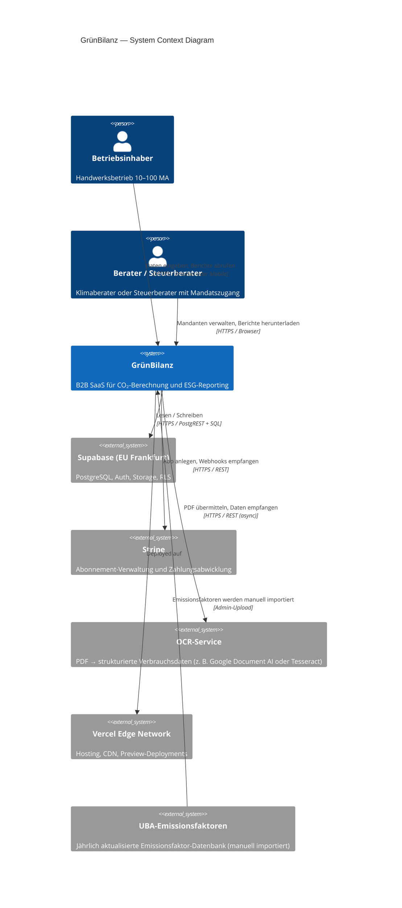
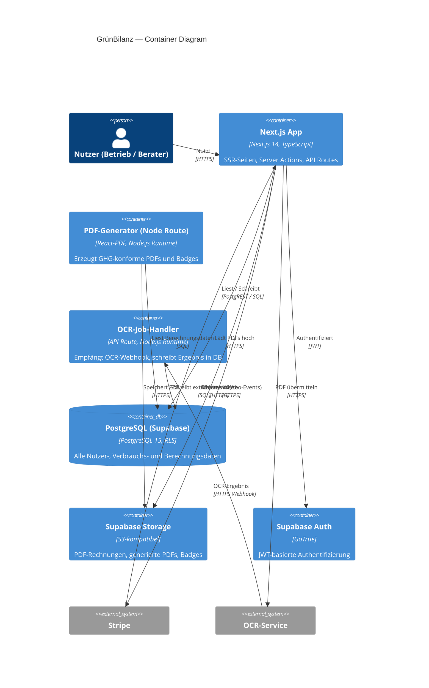
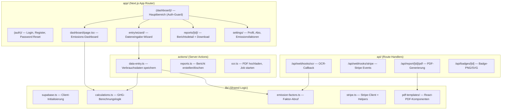
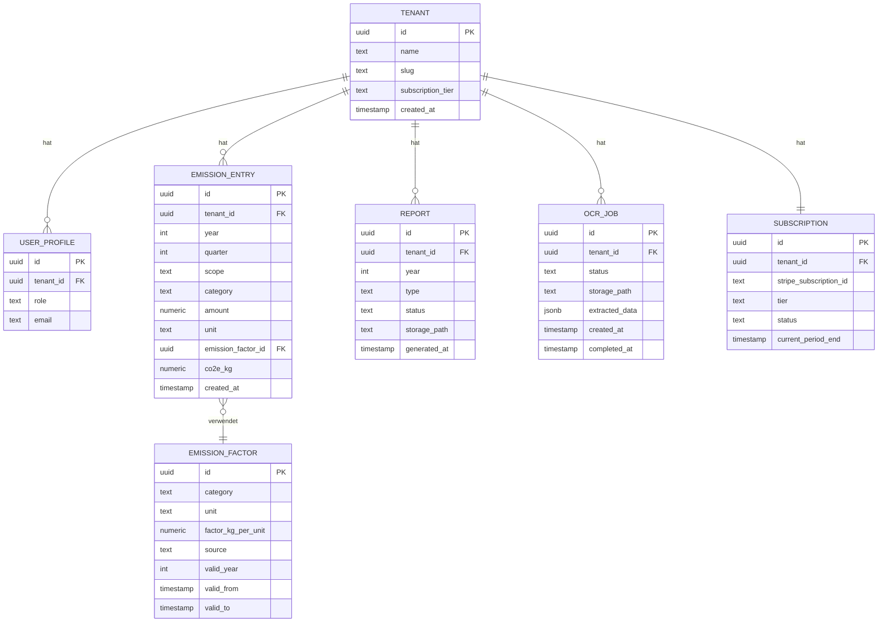
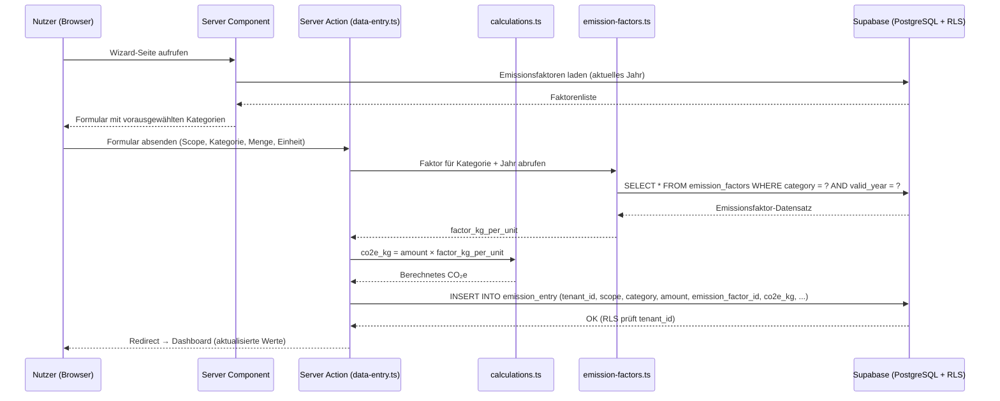
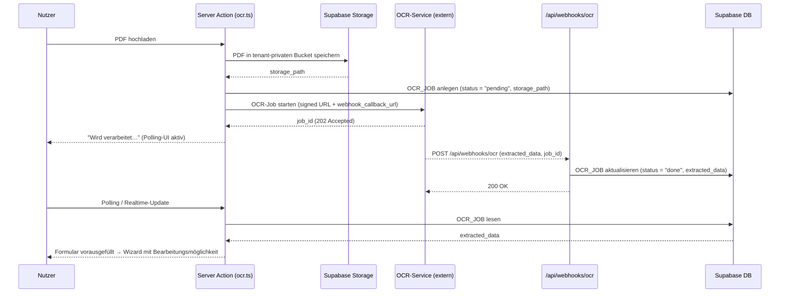
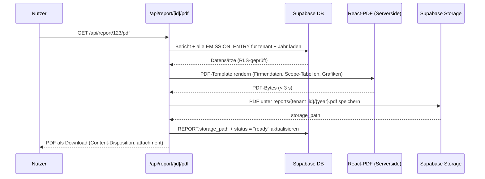
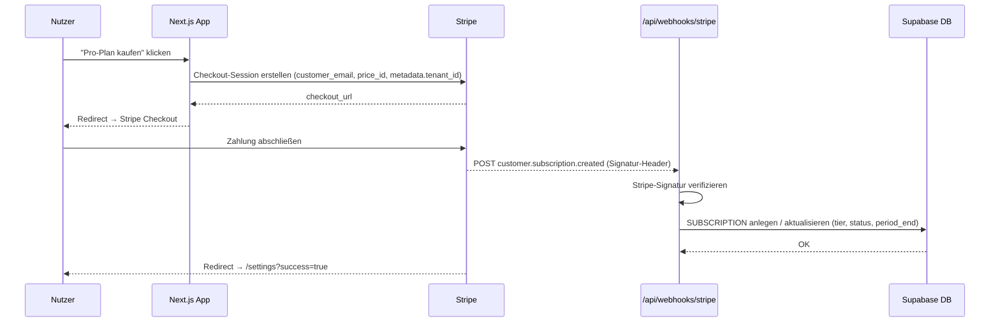
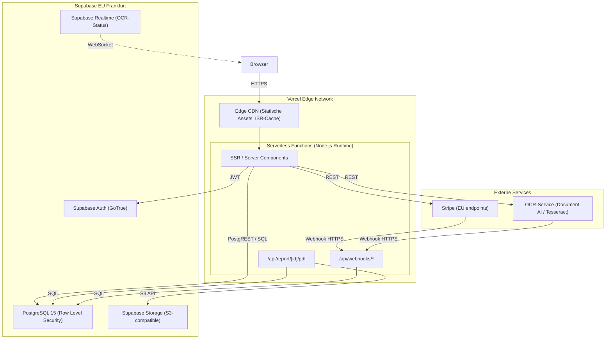
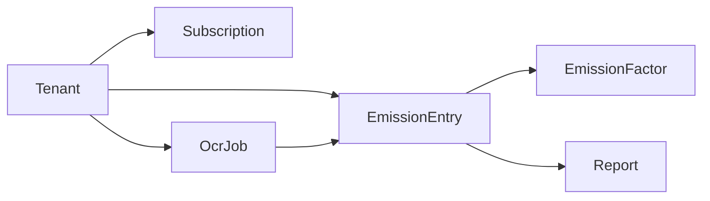

# Architecture Documentation (arc42)

**Project:** GrünBilanz  
**Version:** 1.0  
**Date:** 2026-03-19  
**Status:** Approved

---

## About arc42

This document follows the [arc42 template](https://arc42.org/) for architecture documentation. arc42 is a proven, practical template for software architecture communication and documentation.

---

## 1. Introduction and Goals

### 1.1 Requirements Overview

GrünBilanz is a B2B SaaS platform for CO₂ footprint calculation and ESG reporting, targeted at German Handwerksbetriebe (craftsmen and trade businesses) with 10–100 employees. It enables businesses to calculate their full carbon footprint in accordance with the GHG Protocol and generate compliance-ready reports for clients and financing banks.

**Core Functional Requirements:**

- **CO₂-Berechnung (Full GHG Protocol):**
  - Scope 1: Erdgas (m³), Diesel/Benzin (L), Heizöl (L), Firmenfahrzeuge (km)
  - Scope 2: Strom (kWh), Fernwärme (kWh)
  - Scope 3: Geschäftsreisen, Pendlerverkehr, Materialien, Abfall
  - Emissionsfaktoren: UBA 2024, versioniert in der Datenbank (nie hartcodiert)
- **Dateneingabe:**
  - Manueller Eingabe-Wizard (je Jahr oder Quartal)
  - PDF-Rechnungsupload → OCR-Extraktion → vorausgefülltes Formular
- **Berichterstattung:**
  - Dashboard: Scope-Aufschlüsselung, Jahresvergleich, Branchenvergleich
  - PDF-Bericht (GHG-Protocol-konform, gebrandmarkt)
  - Nachhaltigkeits-Badge (PNG/SVG)
  - CSRD-Lieferantenfragebogen (PDF, ein Klick)
- **Monetisierung:** Stripe-Abo-Modell (Free-Tier + kostenpflichtige Tiers)
- **Compliance:** DSGVO, EU-Datenhaltung (Supabase EU Frankfurt)

### 1.2 Quality Goals

| Priorität | Qualitätsziel | Szenario |
|-----------|--------------|----------|
| 1 | **Datenschutz & Compliance** | Alle Mandantendaten sind vollständig isoliert; DSGVO-Konformität jederzeit gewährleistet |
| 2 | **Zuverlässigkeit der Berechnungen** | Emissionsfaktoren sind stets auf dem aktuellen UBA-Stand; Berechnungen sind nachvollziehbar und reproduzierbar |
| 3 | **Performance** | PDF-Generierung < 3 Sekunden; Dashboard-Laden < 1,5 Sekunden; API-Antworten < 500 ms für 95 % der Anfragen |
| 4 | **Mobile-First-Nutzbarkeit** | Vollständiger Workflow (Dateneingabe, Berichte) auf Smartphone-Bildschirmen nutzbar |
| 5 | **Wartbarkeit** | Neue Emissionsfaktoren und Reporting-Templates können ohne Code-Deployment eingepflegt werden |

### 1.3 Stakeholders

| Rolle | Erwartungen | Bedenken |
|-------|-------------|----------|
| Handwerksbetrieb (Endkunde) | Einfache Dateneingabe per Smartphone, schnelle Berichte für Bankgespräche | Datenschutz, Verständlichkeit der CO₂-Zahlen |
| Unternehmensinhaber | Nachvollziehbare Emissionsberechnungen, professionelles PDF für Kunden | Kosten der Nutzung, Zeitaufwand |
| Buchhaltung / Büro | Rechnungs-Upload statt manueller Eingabe | Korrektheit der OCR-Extraktion |
| Klimaberater / Steuerberater | API-Zugang, Mandantenübersicht | Datenqualität, Auditierbarkeit |
| GrünBilanz-Betreiber | Skalierbarkeit, Subscription-Revenue, niedriger Betriebsaufwand | Infrastrukturkosten, Regulatorik |
| Banken / Kunden des Betriebs | GHG-Protocol-konforme Berichte, CSRD-Fragebogen | Glaubwürdigkeit der Daten |

---

## 2. Constraints

### 2.1 Technische Constraints

| Constraint | Hintergrund / Begründung |
|-----------|--------------------------|
| Next.js 14 (App Router), TypeScript, Tailwind CSS | Festgelegter Frontend-Stack; ermöglicht SSR, React Server Components und optimales Mobile-Rendering |
| Supabase (PostgreSQL + Row Level Security) | Festgelegte Datenbankplattform; liefert Auth, RLS und realtime out-of-the-box |
| Supabase EU Frankfurt | DSGVO erfordert EU-Datenhaltung; Frankfurt ist einzige EU-Region mit vollem Feature-Satz |
| Vercel (Deployment) | Nahtlose Next.js-Integration, Edge-Netzwerk, Preview-Deployments |
| React-PDF (PDF-Generierung) | Festgelegtes Library; muss serverside-gerendert werden (Node.js Runtime, kein Edge) |
| Stripe (Payments) | Festgelegte Payment-Plattform; PCI-DSS-Compliance ausgelagert |
| Emissionsfaktoren niemals hartcodiert | Regulatorische Anforderung; UBA aktualisiert Faktoren jährlich; müssen DB-seitig versioniert sein |

### 2.2 Organisatorische Constraints

| Constraint | Hintergrund / Begründung |
|-----------|--------------------------|
| Deutschsprachige UI | Zielgruppe sind deutsche Handwerksbetriebe; UI, Fehlermeldungen und Berichte vollständig auf Deutsch |
| Mobile-First | Viele Nutzer greifen per Smartphone zu; Layouts und Flows primär für < 390 px Viewport entwickeln |
| DSGVO-Konformität | Personenbezogene Daten (Mitarbeiterzahl, Verbrauchsdaten) unterliegen DSGVO |
| GHG-Protocol-Konformität | Berichte müssen GHG Protocol Corporate Standard Accounting & Reporting entsprechen |
| PDF-Generierungszeit < 3 s | Nutzererlebnis-Anforderung; bei längeren Wartezeiten deutliche UX-Degradation |

### 2.3 Konventionen

| Konvention | Beschreibung |
|-----------|--------------|
| TypeScript Strict Mode | Strikt typisiert; ESLint + Prettier; keine `any`-Typen in Produktionscode |
| Git-Workflow | Feature-Branches, Rebase-Merge; Conventional Commits |
| Dokumentation | Markdown in `docs/`; ADRs für Architekturentscheidungen |
| Umgebungsvariablen | Secrets nie im Quellcode; `.env.local` für lokal, Vercel-Dashboard für Produktion |
| Testabdeckung | Vitest für Unit/Integration, Playwright für E2E; kritische Pfade ≥ 80 % Coverage |

---

## 3. Context and Scope

### 3.1 Business Context



**Kommunikationspartner:**

| Partner | Eingehende Daten | Ausgehende Daten |
|---------|-----------------|-----------------|
| Betriebsinhaber | Verbrauchsdaten, PDF-Rechnungen | Dashboard, PDF-Berichte, Badge |
| Berater / Steuerberater | Mandatsdaten, Genehmigungen | Mandanten-Übersicht, Berichte |
| Supabase | DB-Abfragen, Auth-Tokens | Datensätze, JWT |
| Stripe | Checkout-Events, Webhooks | Abo-Status, Zahlungslinks |
| OCR-Service | PDF-Binärdaten | Extrahierte Verbrauchsmengen |
| UBA | — | Emissionsfaktoren (manueller Import) |

### 3.2 Technical Context

| Schnittstelle | Beschreibung | Protokoll / Format |
|--------------|-------------|-------------------|
| Next.js App Router | SSR-Seiten, React Server Components | HTTPS, HTML |
| Server Actions | Formulareingaben, Datenmutationen | HTTP POST, JSON |
| Supabase PostgREST | DB-Lesen/Schreiben via Row Level Security | HTTPS, JSON |
| Supabase Auth | JWT-basierte Session | HTTPS, JWT (Cookie) |
| Supabase Storage | PDF-Uploads (Rechnungen) | HTTPS, Multipart |
| Stripe API + Webhooks | Abo-Verwaltung, Zahlungsstatus | HTTPS, JSON |
| OCR-Webhook | Asynchrone Ergebnisse nach PDF-Analyse | HTTPS, JSON |
| React-PDF (Server) | PDF-Generierung im Node.js-Prozess | Interner Aufruf, PDF-Bytes |

---

## 4. Solution Strategy

**Fundamentale Entscheidungen zur Erreichung der Qualitätsziele:**

| Qualitätsziel | Ansatz | Begründung |
|--------------|--------|------------|
| Datenschutz & Mandantenisolation | Row Level Security (RLS) in Supabase | Alle Tabellen tragen eine `tenant_id`; Postgres-Policies verhindern mandantenübergreifende Lesezugriffe (→ ADR-001) |
| Zuverlässige Berechnungen | Emissionsfaktoren DB-seitig versioniert | Faktoren erhalten `valid_from`/`valid_to` + UBA-Jahres-Tag; Berechnungen referenzieren immer die exakte Version (→ ADR-003) |
| Performance der PDF-Generierung | Server-Side-Rendering mit React-PDF in Node.js-Route | Edge Runtime unterstützt React-PDF nicht; dedizierte `/api/report/[id]/pdf`-Route mit Node.js-Runtime |
| OCR-Verlässlichkeit | Asynchrone OCR-Pipeline mit Job-Queue | Synchrone OCR überschreitet Vercel-Function-Timeout (10 s); Ergebnis wird per Webhook geliefert (→ ADR-002) |
| Monetisierung | Stripe Subscriptions mit drei Tiers | Einfaches Abrechnungsmodell passend zur Zielgruppe; Stripe übernimmt PCI-Compliance (→ ADR-004) |
| Mobile-First | Tailwind CSS + Next.js App Router | Utility-first CSS ermöglicht schnelles responsives Layout; Server Components minimieren JS-Bundle |
| DSGVO | Supabase EU Frankfurt + RLS | Keine Daten verlassen die EU; RLS verhindert Datenlecks auch bei Application-Bugs |

**Architekturmuster:**

- **Multi-Tenant SaaS mit RLS:** Alle Nutzerdaten sind an eine `tenant_id` gebunden; Supabase RLS-Policies erzwingen Isolation auf Datenbankebene
- **Server-First:** Geschäftslogik lebt in Server Actions und API Routes (nie im Client), um Secrets und Berechnungslogik zu schützen
- **Event-Driven OCR:** PDF-Upload triggert einen asynchronen Job; Status-Polling oder Webhook-Callback aktualisiert die UI
- **Versionierte Stammdaten:** Emissionsfaktoren sind unveränderliche Datensätze; Berechnungen referenzieren immer einen konkreten Faktor-Snapshot
- **Stripe-Webhook-First:** Abo-Status wird ausschließlich über verifizierte Stripe-Webhooks gesetzt, nie durch Client-Calls

---

## 5. Building Block View

### 5.1 Level 1: System-Überblick



**Komponenten-Überblick:**

| Komponente | Verantwortung | Technologie |
|------------|--------------|-------------|
| Next.js App | UI, Routing, Server Actions, API Routes | Next.js 14, TypeScript, Tailwind |
| PDF-Generator (Node Route) | Serverside PDF-Rendering < 3 s | React-PDF, Node.js Runtime |
| OCR-Job-Handler | Webhook-Empfang, Daten-Persistierung | Next.js API Route, Node.js Runtime |
| PostgreSQL (Supabase) | Alle persistenten Daten, RLS-Isolation | PostgreSQL 15 + Supabase |
| Supabase Storage | Binary Assets (Uploads, generierte Dateien) | S3-kompatibel, RLS |
| Supabase Auth | Authentifizierung, Session-Verwaltung | GoTrue / JWT |

### 5.2 Level 2: Next.js App — Interne Struktur



**Schichten:**

- **`app/`** — Next.js-Seiten (Server Components + Client Components); Routing und Darstellung
- **`api/`** — Route Handler für PDFs, Webhooks, Badges (Node.js Runtime)
- **`lib/`** — Reine Geschäftslogik und Service-Clients; keine React-Abhängigkeiten
- **`actions/`** — Server Actions für Datenmutationen; werden direkt von Forms aufgerufen

### 5.3 Datenbankschema (vereinfacht)



---

## 6. Runtime View

### 6.1 Szenario: Manuelle Dateneingabe (Wizard)



### 6.2 Szenario: PDF-Rechnungs-Upload mit OCR



### 6.3 Szenario: PDF-Berichtsgenerierung



### 6.4 Szenario: Stripe-Abo-Aktivierung



---

## 7. Deployment View

### 7.1 Infrastruktur



### 7.2 Umgebungen

| Umgebung | Zweck | Konfiguration |
|---------|-------|---------------|
| **Lokal (Development)** | Entwicklung und Tests | `next dev`; Supabase CLI lokal (`supabase start`); Stripe CLI für Webhooks |
| **Preview (Vercel)** | PR-basierte Vorschau | Automatisch bei jedem PR; eigene Supabase-Branch via Branching-Feature |
| **Production** | Live-System | Vercel Production-Deployment; Supabase EU Frankfurt; Stripe Live-Mode |

### 7.3 Skalierung

- **Vercel Serverless Functions** skalieren automatisch mit der Last; kein manuelles Tuning
- **Supabase** ist managed; PostgreSQL-Connection-Pooling via PgBouncer ist standardmäßig aktiv
- **PDF-Generierung** ist statuslos; jede Funktion läuft isoliert ohne geteilten Zustand
- **OCR** ist vollständig ausgelagert; interner Code ist nie der Bottleneck

---

## 8. Crosscutting Concepts

### 8.1 Domain Model

Die Kerndomain dreht sich um den **Tenant** (= Betrieb), dessen **Emissionseinträge** und die daraus erzeugten **Berichte**.



Zentrale Invarianten:
- Jeder `EmissionEntry` referenziert exakt einen `EmissionFactor` (unveränderlich nach Erstellung)
- `co2e_kg` wird bei Erstellung berechnet und persistiert; nachträgliche Faktoränderungen invalidieren bestehende Einträge nicht
- Ein `Report` ist ein Point-in-Time-Snapshot; er wird nach Generierung als PDF in Storage abgelegt

### 8.2 Sicherheit

- **Authentifizierung:** Supabase Auth (GoTrue); JWT in HttpOnly-Cookie; kein Zugriff über JavaScript
- **Autorisierung (Datenbankebene):** Row Level Security auf allen Datentabellen; Policy: `tenant_id = auth.jwt() ->> 'tenant_id'`
- **Autorisierung (Anwendungsebene):** Server Actions prüfen Session vor jeder Mutation; `getSession()` wird nie auf dem Client aufgerufen
- **Stripe-Webhooks:** Signatur mit `stripe.webhooks.constructEvent()` verifiziert; ungültige Signaturen werden mit 400 abgelehnt
- **OCR-Webhooks:** Shared Secret in Header; Route verweigert Anfragen ohne gültiges Secret
- **Storage-Isolation:** Supabase-Storage-Policies spiegeln RLS; Nutzer können nur eigene Tenant-Buckets lesen
- **Eingabevalidierung:** Zod-Schemata in allen Server Actions; niemals rohe Formulardaten persistieren
- **Secrets:** Niemals im Client-Bundle; alle API-Keys in Vercel-Umgebungsvariablen (Server-only)
- **DSGVO:** Keine Datenweitergabe an Dritte außer Stripe (Zahlung) und OCR-Service (nur PDF-Dokumente, keine Personendaten); Auftragsverarbeitungsvertrag (AVV) mit beiden

### 8.3 Fehlerbehandlung

- **Server Actions:** Werfen typisierte Fehler (`ActionError`); Client zeigt lokalisierte deutsche Meldungen
- **API Routes:** Standardisiertes JSON-Fehlerformat `{ error: string, code: string }`; HTTP-Status entsprechend
- **OCR-Fehler:** Job-Status wird auf `"failed"` gesetzt; Nutzer sieht Fehlermeldung + Option zum manuellen Überschreiben
- **Stripe-Webhooks:** Idempotenz-Keys verhindern Doppelverarbeitung; fehlgeschlagene Webhooks werden von Stripe automatisch wiederholt
- **Logging:** Strukturiertes Logging über Vercel-Log-Drain; kein personenbezogenes Datum in Logs
- **Monitoring:** Vercel-Analytics + Supabase-Dashboard; kritische Fehler via Alert-Webhook (z. B. Slack)

### 8.4 Testing

- **Unit-Tests:** Vitest; Berechnungslogik in `lib/calculations.ts` und `lib/emission-factors.ts` vollständig abgedeckt
- **Integration-Tests:** Vitest + Supabase-CLI-Local; Server Actions gegen lokale Datenbank
- **E2E-Tests:** Playwright; kritische User-Journeys: Registrierung, Dateneingabe-Wizard, PDF-Download, Abo-Abschluss
- **Coverage-Ziel:** ≥ 80 % für `lib/` und `actions/`; PDF-Rendering und OCR-Webhook manuell getestet

### 8.5 Konfigurationsmanagement

- **Umgebungsvariablen:** `.env.local` lokal; Vercel-Dashboard für Staging und Produktion
- **Pflichtumgebungsvariablen:**
  ```
  NEXT_PUBLIC_SUPABASE_URL        # Supabase Projekt-URL
  NEXT_PUBLIC_SUPABASE_ANON_KEY   # Öffentlicher Supabase-Key
  SUPABASE_SERVICE_ROLE_KEY       # Server-only: Admin-Zugriff
  STRIPE_SECRET_KEY               # Stripe API Key (Server-only)
  STRIPE_WEBHOOK_SECRET           # Stripe Webhook-Signatur
  OCR_WEBHOOK_SECRET              # Shared Secret für OCR-Callbacks
  OCR_SERVICE_URL                 # URL des OCR-Service
  ```
- **Feature-Flags:** Umgebungsvariablen für experimentelle Features; kein externes Feature-Flag-System erforderlich

### 8.6 Internationalisierung

- UI vollständig auf Deutsch (kein i18n-Framework erforderlich; Hardcoded-Strings in Deutsch sind akzeptabel)
- Zahlenformate: Deutsches Dezimaltrennzeichen (Komma) in der UI; interne Speicherung als `numeric` (Punkt-Separator)
- Datumsformate: TT.MM.JJJJ in der UI; ISO 8601 intern

---

## 9. Architecture Decisions

### ADR-001: Multi-Tenancy-Isolation — Row Level Security (RLS)

**Status:** Accepted

**Kontext:** GrünBilanz ist ein Multi-Tenant-SaaS; jeder Betrieb (Tenant) muss vollständig vom Datenzugriff anderer Tenants isoliert sein.

**Optionen:**

| Option | Beschreibung | Vorteile | Nachteile |
|--------|-------------|----------|-----------|
| **RLS (Row Level Security)** | Alle Tabellen tragen `tenant_id`; Supabase-Policies erzwingen Isolation auf DB-Ebene | DSGVO-sicher durch DB-Level-Schutz; kein Schema-Management; einfaches Onboarding neuer Tenants | Policies müssen sorgfältig gepflegt werden; Fehler in einer Policy kann Daten leaken; Performance-Overhead bei komplexen Queries |
| **Schema per Tenant** | Jeder Tenant erhält ein eigenes PostgreSQL-Schema (`tenant_abc.emission_entries`) | Vollständige Isolation; einfaches Backup/Restore per Tenant | Supabase unterstützt Schema-Branching nicht nativ; hoher Migrations-Overhead; schlecht skalierbar bei > 100 Tenants |
| **Separate Datenbank pro Tenant** | Jeder Tenant bekommt eine eigene Supabase-Instanz | Maximale Isolation; individuelle Skalierung | Kosten prohibitiv; operativer Aufwand extrem hoch; nicht praktikabel für Handwerks-SaaS |

**Entscheidung:** **Row Level Security (RLS)**

**Begründung:** RLS ist der von Supabase empfohlene und dokumentierte Standard. Es bietet DB-Level-Isolation (erfüllt DSGVO-Anforderungen), ermöglicht kostenloses Onboarding neuer Tenants ohne Infrastrukturänderungen und integriert nahtlos mit Supabase Auth. Der Performance-Overhead ist bei erwarteten Datenmengen (< 10.000 Einträge pro Tenant) vernachlässigbar. Schema-per-Tenant wäre bei Supabase operativ aufwendig und schlecht unterstützt.

**Implementierungshinweise:**
- Jede Datentabelle erhält eine `tenant_id UUID NOT NULL` Spalte mit einem Index
- RLS-Policies folgen dem Muster: `USING (tenant_id = (auth.jwt() ->> 'tenant_id')::uuid)`
- `tenant_id` wird beim Tenant-Onboarding in den JWT-Claims gesetzt (`app_metadata.tenant_id`)
- Service-Role-Key wird nur in Server Actions und API Routes verwendet, nie im Client

---

### ADR-002: OCR-Pipeline — Asynchron mit Webhook-Callback

**Status:** Accepted

**Kontext:** Nutzer laden PDF-Rechnungen hoch; die Software soll Verbrauchsmengen (kWh, L, m³) automatisch extrahieren und das Eingabeformular vorausfüllen. Vercel Serverless Functions haben ein Timeout von 10 Sekunden (Hobby: 10 s, Pro: 60 s).

**Optionen:**

| Option | Beschreibung | Vorteile | Nachteile |
|--------|-------------|----------|-----------|
| **Synchrone OCR** | Server Action sendet PDF an OCR-API, wartet auf Antwort, gibt Ergebnis zurück | Einfachste Implementierung; kein zusätzlicher State | OCR dauert 5–30 s; überschreitet Vercel-Timeout; Nutzer hängt in der UI |
| **Asynchron + Polling** | Job wird gestartet; Client pollt `/api/ocr/status/[jobId]` alle 2 s | Kein Webhook-Infra nötig; simpel zu debuggen | Viele unnötige Requests; Skalierungsproblem bei vielen gleichzeitigen Jobs |
| **Asynchron + Webhook (empfohlen)** | OCR-Service ruft `/api/webhooks/ocr` auf, wenn fertig; Supabase Realtime pusht Update an Client | Kein Polling; skaliert gut; Ressourcen-effizient; Nutzererfahrung flüssig | Zusätzliche Komplexität: Webhook-Endpoint + Realtime-Abo; OCR-Service muss Webhooks unterstützen |
| **Background Jobs (Supabase Edge Functions)** | Supabase Edge Function startet OCR-Job asynchron | Innerhalb Supabase-Ökosystem | Limitierte Laufzeit (2 min); noch ein weiteres System zu warten |

**Entscheidung:** **Asynchron mit Webhook-Callback + Supabase Realtime**

**Begründung:** Die synchrone Option ist technisch nicht realisierbar (Timeout). Polling ist ineffizient. Webhooks + Supabase Realtime ist die sauberste Lösung: Der OCR-Service ruft den Webhook auf, der DB-Eintrag wird aktualisiert, und Supabase Realtime pusht die Änderung an die wartende UI. Die zusätzliche Komplexität (Webhook-Endpoint, Shared Secret) ist überschaubar.

**Implementierungshinweise:**
- `OCR_JOB`-Tabelle mit `status IN ('pending', 'processing', 'done', 'failed')`
- Realtime-Abo auf `ocr_jobs` im Client; UI wechselt automatisch zum Wizard wenn `status = 'done'`
- Fallback: Manuelles Refresh-Button falls Realtime-Verbindung unterbrochen
- OCR-Webhook-Endpoint verifiziert `X-OCR-Secret` Header

---

### ADR-003: Emissionsfaktor-Versionierung

**Status:** Accepted

**Kontext:** Das UBA (Umweltbundesamt) aktualisiert Emissionsfaktoren jährlich. Historische Berichte müssen mit den Faktoren des jeweiligen Berichtsjahres reproduzierbar sein. Faktoren dürfen niemals hartcodiert sein.

**Optionen:**

| Option | Beschreibung | Vorteile | Nachteile |
|--------|-------------|----------|-----------|
| **Jahres-basierte Versionierung** | `emission_factors` Tabelle mit `valid_year INT` und `source TEXT` (z. B. "UBA 2024"); jeder Eintrag referenziert `emission_factor_id` | Einfach abzufragen; natürliches mentales Modell | Kein Sub-Jahres-Update möglich; wenn UBA mitten im Jahr korrigiert, ist kein Update möglich |
| **Zeitraum-basierte Versionierung (empfohlen)** | `valid_from TIMESTAMP` + `valid_to TIMESTAMP` (NULL = aktuell gültig); `source` + `version_tag TEXT` | Präzise Gültigkeit; Mid-Year-Updates möglich; Abfrage via `NOW() BETWEEN valid_from AND valid_to` | Etwas komplexere Abfrage; `valid_to = NULL` muss korrekt behandelt werden |
| **Snapshot-Tabelle pro Importzeitpunkt** | Jeder UBA-Import erzeugt eine neue Versions-Reihe in einer separaten Tabelle | Vollständige Audit-Trail des Import-Prozesses | Sehr hohe Tabellenkomplexität; selten benötigt |

**Entscheidung:** **Zeitraum-basierte Versionierung** mit `valid_from`/`valid_to` + `valid_year` + `version_tag`

**Begründung:** `valid_year` dient als schnelles Lookup-Feld für Berichtsjahre (z. B. Bericht 2024 → `valid_year = 2024`). `valid_from`/`valid_to` ermöglichen zusätzlich Mid-Year-Korrekturen des UBA, ohne bestehende Berechnungen zu invalidieren. `version_tag` (z. B. "UBA 2024 v1.2") ermöglicht Audit-Trail.

**Implementierungshinweise:**
- Neue Faktoren werden per Admin-UI importiert (CSV-Upload oder manuell)
- Beim Import: `valid_to` des Vorgänger-Datensatzes wird auf `NOW()` gesetzt; neuer Datensatz erhält `valid_from = NOW()`, `valid_to = NULL`
- `EmissionEntry.emission_factor_id` ist unveränderlich nach Erstellung (kein Cascade-Update)
- Abruf-Funktion: `getFactorForCategory(category, year)` → wählt Faktor mit `valid_year = year AND valid_to IS NULL OR valid_to > [start of year]`

---

### ADR-004: Monetisierungsmodell — Stripe Subscriptions mit drei Tiers

**Status:** Accepted

**Kontext:** GrünBilanz richtet sich an Handwerksbetriebe (10–100 MA). Diese Zielgruppe ist preissensitiv, aber bereit für klaren Nutzen zu zahlen. Das Modell muss einfach verständlich sein und den Wechsel zu höheren Tiers incentivieren.

**Empfohlenes Modell:**

| Tier | Preis (monatlich, ggf. rabattiert jährlich) | Enthaltene Leistungen |
|------|---------------------------------------------|----------------------|
| **Free (Kostenlos)** | 0 € | 1 Berichtsjahr, nur Scope 1+2, kein PDF-Export, Branding "Powered by GrünBilanz" |
| **Starter** | 29 €/Monat (290 €/Jahr) | 3 Berichtsjahre, Scope 1+2+3, PDF-Export ohne Branding, Nachhaltigkeits-Badge |
| **Professional** | 79 €/Monat (790 €/Jahr) | Unbegrenzte Jahre, OCR-Rechnungs-Upload, CSRD-Fragebogen, Branchenvergleich, Priority Support |

**Optionen:**

| Option | Beschreibung | Vorteile | Nachteile |
|--------|-------------|----------|-----------|
| **Nutzungsbasiert (pay-per-report)** | Pro generiertem Bericht wird abgerechnet | Geringe Einstiegshürde | Unvorhersehbare Kosten für Nutzer; hoher Stripe-Overhead bei kleinen Beträgen |
| **Drei-Tier-Subscription (empfohlen)** | Fester Monatsbetrag, klar definierte Feature-Unterschiede | Planbare Kosten; einfache Kommunikation; Standard im B2B-SaaS | Nutzer könnte "zu viel" zahlen wenn Nutzung gering |
| **Freemium ohne Kreditkarte** | Free-Tier unlimitiert, kein erzwungener Upgrade-Flow | Niedrige Einstiegshürde; virale Verbreitung via Badge | Konvertierungsrate in B2B schwierig ohne klare Wertbarriere |

**Entscheidung:** **Drei-Tier-Subscription** (Free / Starter / Professional) via Stripe Subscriptions

**Begründung:** Handwerksbetriebe bevorzugen planbare Fixkosten. Das Three-Tier-Modell ist im deutschen B2B-SaaS-Markt etabliert und leicht verständlich. Der Jahresrabatt (~17 %) incentiviert längere Bindung. Die Feature-Unterschiede (OCR, CSRD, Branchenvergleich) sind für die Zielgruppe klar nachvollziehbar und tragen echten Mehrwert.

**Implementierungshinweise:**
- `SUBSCRIPTION.tier IN ('free', 'starter', 'professional')` in der DB
- Tier-Prüfung in Server Actions via `checkSubscriptionTier(tenantId, requiredTier)`
- Stripe-Webhook setzt DB-Tier bei `customer.subscription.updated/deleted`
- Jahrespreis-Produkte als separate Stripe-Prices (gleiche Product-ID, anderes Interval)
- Downgrade-Logik: bei Kündigung → `free` nach Ablauf der bezahlten Periode

---

## 10. Quality Requirements

### 10.1 Quality Tree

```
Qualität (GrünBilanz)
├── Sicherheit & Compliance
│   ├── Datenisolation (RLS auf DB-Ebene — ADR-001)
│   ├── DSGVO (EU-Datenhaltung, AVV, minimale Datenerhebung)
│   └── Eingabevalidierung (Zod in allen Server Actions)
├── Zuverlässigkeit der Berechnungen
│   ├── Emissionsfaktor-Versionierung (ADR-003)
│   ├── Unveränderliche Berechnungs-Snapshots
│   └── GHG-Protocol-Konformität (Scope 1, 2, 3)
├── Performance
│   ├── PDF-Generierung < 3 s
│   ├── Dashboard-Laden < 1,5 s (SSR + RLS-optimierte Queries)
│   └── API-Antworten < 500 ms (p95)
├── Nutzbarkeit
│   ├── Mobile-First (< 390 px Viewport, Touch-optimiert)
│   ├── Deutschsprachige UI
│   └── OCR-Vorausfüllung (spart Dateneingabe)
└── Wartbarkeit
    ├── Emissionsfaktoren ohne Code-Deployment aktualisierbar
    ├── Reporting-Templates austauschbar (React-PDF-Komponenten)
    └── Testabdeckung ≥ 80 % für Berechnungslogik
```

### 10.2 Quality Scenarios

| ID | Qualität | Stimulus | Antwort | Messgröße |
|----|---------|---------|---------|-----------|
| QS-1 | Performance | Nutzer öffnet Dashboard | Seite lädt vollständig | < 1,5 s (LCP) |
| QS-2 | Performance | Nutzer lädt PDF-Bericht herunter | PDF wird generiert und ausgeliefert | < 3 s end-to-end |
| QS-3 | Sicherheit | Angemeldeter Nutzer versucht Daten eines anderen Tenants abzurufen | DB verweigert Zugriff (RLS) | 0 Datensätze zurückgegeben; kein 500-Fehler |
| QS-4 | Zuverlässigkeit | UBA veröffentlicht neue Emissionsfaktoren für 2025 | Admin importiert neue Faktoren ohne Code-Deployment | Neue Berechnungen verwenden 2025er Faktoren; 2024er Berichte unverändert |
| QS-5 | Nutzbarkeit | Nutzer öffnet Dateneingabe-Wizard auf iPhone SE (375 px) | Wizard vollständig bedienbar | Kein horizontales Scrollen; Touch-Targets ≥ 44 px |
| QS-6 | Nutzbarkeit | Nutzer lädt Diesel-Rechnung (PDF) hoch | OCR extrahiert Menge in < 60 s | Feld "Liter Diesel" vorausgefüllt; Nutzer kann korrigieren |
| QS-7 | Wartbarkeit | Neues GHG-Scope-3-Subkategorie soll hinzugefügt werden | Entwickler fügt Kategorie + Faktor hinzu | < 1 Arbeitstag ohne Breaking Changes |
| QS-8 | Verfügbarkeit | Vercel-Deployment fehlschlägt | Preview-Deployment schlägt fehl; Produktion unberührt | Zero-Downtime-Deployments |

---

## 11. Risks and Technical Debt

### 11.1 Risiken

| Risiko | Wahrscheinlichkeit | Auswirkung | Minderungsmaßnahme |
|--------|-------------------|-----------|-------------------|
| **RLS-Policy-Fehler** führt zu mandantenübergreifenden Datenlecks | Gering | Kritisch | Automatisierte RLS-Tests in CI; Code-Reviews für alle Datenbankmigrationen; regelmäßige Sicherheitsaudits |
| **OCR-Service fällt aus** oder liefert schlechte Qualität | Mittel | Mittel | Manuelles Eingabeformular immer verfügbar als Fallback; OCR ist Komfort-Feature, kein Pflichtpfad |
| **Vercel-Function-Timeout** bei sehr großen PDFs (viele Emissionseinträge) | Gering | Mittel | PDF-Generierung auf < 500 Einträge begrenzen (warnen); bei Überschreitung: async Job mit Polling |
| **Stripe-API-Downtime** blockiert Abo-Abschluss | Gering | Mittel | Bestandsnutzer mit aktiver Subscription sind nicht betroffen; nur Neukauf scheitert |
| **UBA veröffentlicht Faktoren sehr spät** oder ändert Methodik | Mittel | Mittel | Versionierungssystem erlaubt retroaktive Updates; transparente Kommunikation an Nutzer |
| **DSGVO-Änderungen** erfordern neue Datenpraktiken | Gering | Hoch | DSGVO-Architektur von Anfang an; minimale Datenhaltung; externer Datenschutzbeauftragter |
| **Supabase EU Frankfurt Region Ausfall** | Sehr gering | Hoch | Supabase bietet keine Multi-Region-Replikation im freien Plan; Mitigation: Point-in-Time-Recovery aktivieren; regelmäßige Backups |
| **OCR-Datenschutz** (Rechnungen enthalten ggf. Lieferanteninfos) | Mittel | Mittel | AVV mit OCR-Service-Anbieter; Rechnungen nach OCR-Job löschen (konfigurierbare Retention Policy) |

### 11.2 Technische Schulden (Initial)

| Eintrag | Beschreibung | Auswirkung | Priorität | Plan |
|---------|-------------|-----------|----------|------|
| **Kein Migrations-Rollback-Tooling** | Supabase-Migrationen werden vorwärts angewendet; Rollbacks sind manuell | Mittel bei Produktionsfehlern | Mittel | Rollback-Skripte für kritische Migrationen manuell pflegen |
| **OCR-Anbieter-Lock-in** | Initialer OCR-Anbieter ist fest verdrahtet | Wechsel aufwendig | Niedrig | OCR-Service hinter Interface abstrahieren (`OcrProvider`-Interface) ab Tag 1 |
| **Keine Multi-Language-Unterstützung** | UI ist rein deutsch | Expansion in DACH schwierig | Niedrig | Struktur für i18n vorbereiten (Key-basierte Strings in einem Modul), kein Framework-Overhead |
| **Kein Admin-Panel** | Emissionsfaktoren werden über direkten DB-Zugriff importiert | Abhängigkeit von Entwicklern für Updates | Mittel | Einfaches Admin-UI für Faktor-Verwaltung in Iteration 2 |

---

## 12. Glossary

| Begriff | Definition |
|---------|-----------|
| **CO₂e** | CO₂-Äquivalente — Einheit für Treibhausgasemissionen, normiert auf das Erwärmungspotenzial von CO₂ |
| **Scope 1** | Direkte Emissionen aus eigenen Quellen (Erdgas-Heizung, Firmenfahrzeuge, Heizöl) |
| **Scope 2** | Indirekte Emissionen aus zugekaufter Energie (Strom, Fernwärme) |
| **Scope 3** | Alle anderen indirekten Emissionen (Lieferkette, Pendler, Geschäftsreisen, Abfall) |
| **GHG Protocol** | Greenhouse Gas Protocol — internationaler Standard zur Erfassung und Berichterstattung von Treibhausgasemissionen |
| **CSRD** | Corporate Sustainability Reporting Directive — EU-Richtlinie zur Nachhaltigkeitsberichterstattung |
| **DSGVO** | Datenschutz-Grundverordnung — EU-Verordnung zum Schutz personenbezogener Daten |
| **UBA** | Umweltbundesamt — deutsche Bundesbehörde, die jährlich Emissionsfaktoren für Deutschland publiziert |
| **Emissionsfaktor** | Umrechnungsfaktor von physikalischer Einheit (kWh, L, m³, km) zu CO₂e-Kilogramm |
| **Tenant** | Ein einzelner Handwerksbetrieb als isolierte Organisationseinheit im Multi-Tenant-System |
| **RLS** | Row Level Security — PostgreSQL-Feature zur zeilenbasierten Zugriffssteuerung |
| **Handwerksbetrieb** | Deutsches Gewerbeunternehmen mit handwerklicher Tätigkeit (z. B. Elektriker, Klempner, Maler, Zimmerer) |
| **OCR** | Optical Character Recognition — automatische Texterkennung aus Bildern / PDFs |
| **ADR** | Architecture Decision Record — Dokumentation einer bedeutsamen Architekturentscheidung |
| **SSR** | Server-Side Rendering — Rendering von HTML-Seiten auf dem Server statt im Browser |
| **AVV** | Auftragsverarbeitungsvertrag — Vertrag nach DSGVO Art. 28 für externe Datenverarbeiter |
| **React-PDF** | React-Bibliothek zur serverseitigen PDF-Generierung |
| **Server Action** | Next.js-Feature für serverseitige Formularverarbeitung ohne manuellen API-Endpoint |
| **Branchenvergleich** | Vergleich der eigenen CO₂-Werte mit Benchmark-Daten anderer Betriebe derselben Branche |
| **Nachhaltigkeits-Badge** | Downloadbares PNG/SVG-Siegel, das der Betrieb auf seiner Website oder in Angeboten verwenden kann |

---

## Appendix

### A. Referenzen

- [GHG Protocol Corporate Standard](https://ghgprotocol.org/corporate-standard)
- [UBA Emissionsfaktoren](https://www.umweltbundesamt.de/themen/klima-energie/klimaschutz-energiepolitik-in-deutschland/treibhausgas-emissionen/emissionsfaktoren-co2-emissionen-des-deutschen)
- [CSRD EU-Richtlinie](https://eur-lex.europa.eu/legal-content/DE/TXT/?uri=CELEX%3A32022L2464)
- [Supabase Row Level Security](https://supabase.com/docs/guides/database/postgres/row-level-security)
- [Supabase Auth Docs](https://supabase.com/docs/guides/auth)
- [Stripe Subscriptions](https://stripe.com/docs/billing/subscriptions/overview)
- [React-PDF](https://react-pdf.org/)
- [arc42 Template](https://arc42.org/)
- [Next.js App Router](https://nextjs.org/docs/app)

### B. Revisionshistorie

| Version | Datum | Autor | Änderungen |
|---------|-------|-------|-----------|
| 1.0 | 2026-03-19 | Architect Agent | Initiale Version — alle 12 arc42-Abschnitte; ADR-001 bis ADR-004 |

---

**Hinweis:** Dieses Dokument ist ein lebendes Artefakt. Es wird bei signifikanten Architekturänderungen aktualisiert, insbesondere nach neuen Design-Entscheidungen oder Änderungen an den Emissionsfaktor-Datenstrukturen.
