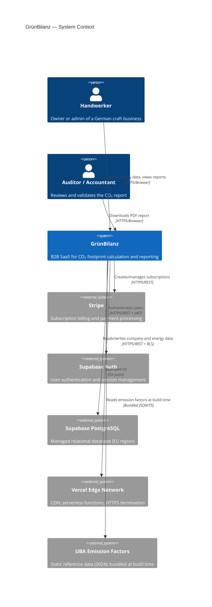
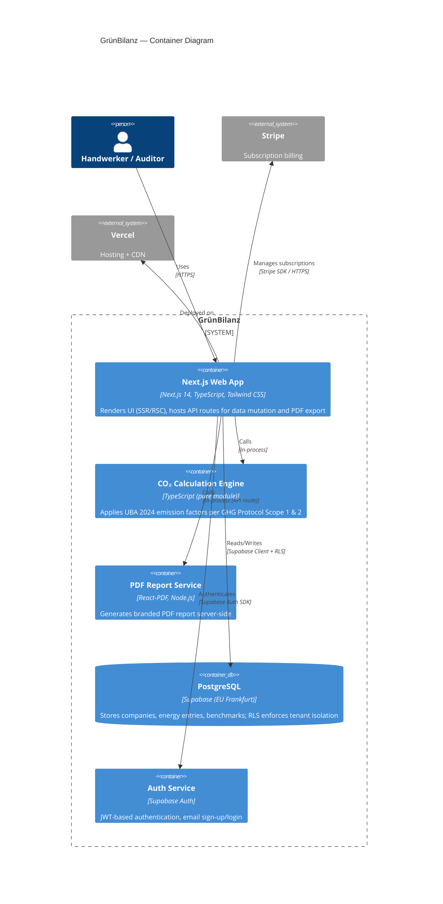
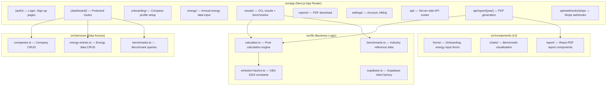
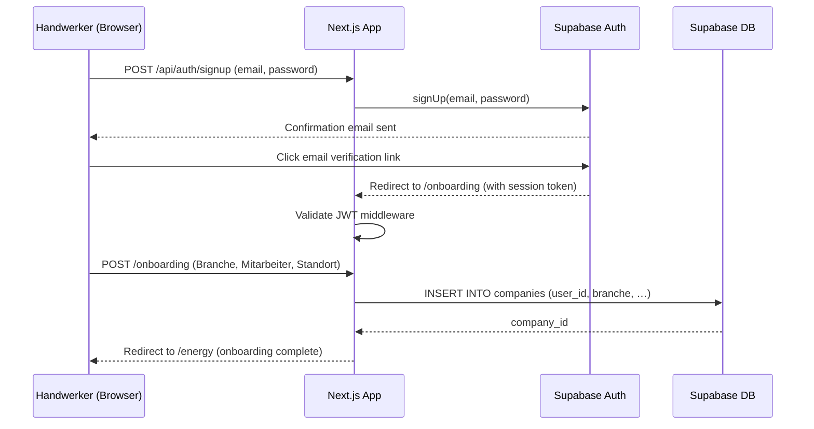
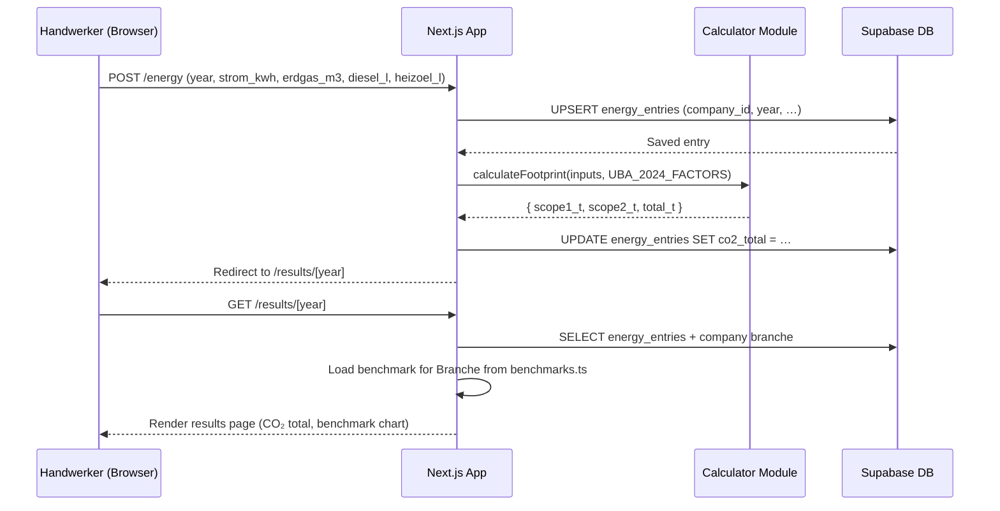
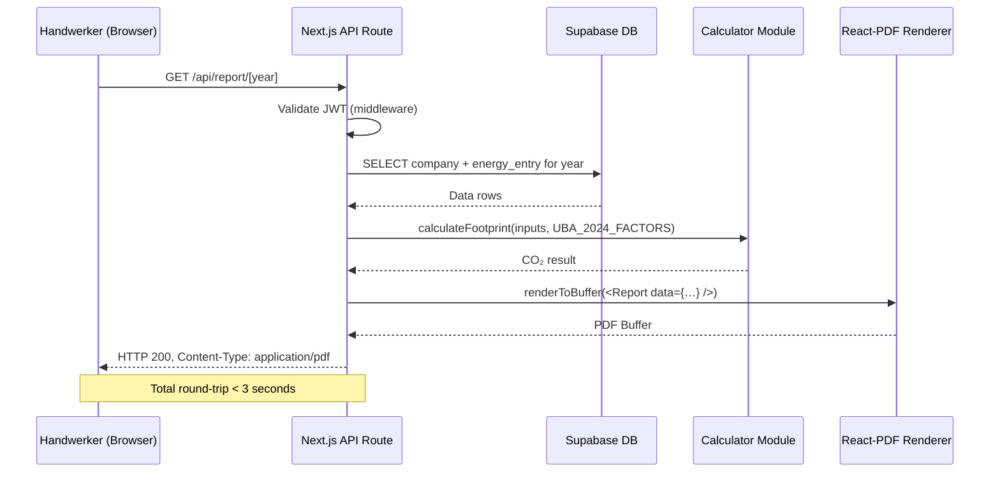
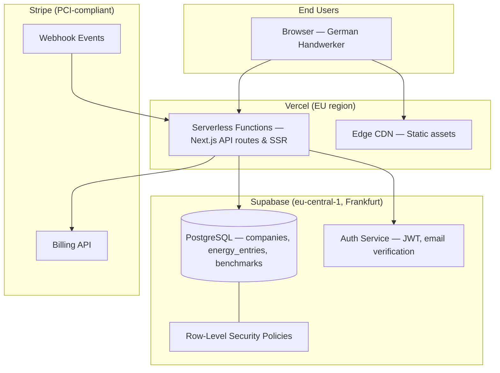
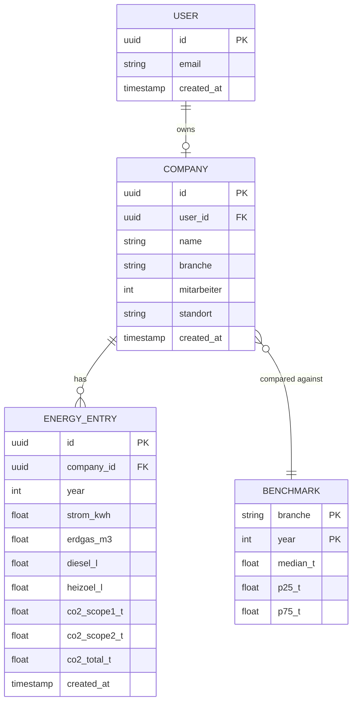

# Architecture Documentation (arc42)

**Project:** GrünBilanz  
**Version:** 1.0  
**Date:** 2026-03-19  
**Status:** Approved

---

## About arc42

This document follows the [arc42 template](https://arc42.org/) for architecture documentation. arc42 is a proven, practical template for software architecture communication and documentation.

---

## 1. Introduction and Goals

### 1.1 Requirements Overview

GrünBilanz is a B2B SaaS platform that enables German Handwerksbetriebe (craft businesses) to measure, track, and report their CO₂ footprint in compliance with the GHG Protocol (Scope 1 & 2).

**Core MVP features:**

- **Company onboarding** — Collect Branche (trade category), Mitarbeiterzahl (headcount), and Standort (location) during sign-up
- **Energy data input** — Enter annual consumption figures: Strom (kWh), Erdgas (m³), Diesel (L), Heizöl (L)
- **CO₂ calculation** — Apply UBA 2024 emission factors following GHG Protocol Scope 1 & 2 methodology
- **Industry benchmark comparison** — Compare a company's footprint against anonymised peer benchmarks per Branche
- **PDF report export** — Generate a branded, downloadable CO₂ report in < 3 seconds
- **Multi-year data storage** — Persist annual entries to enable year-over-year trend analysis

**Out of scope for MVP:**

- Scope 3 emissions (supply chain, business travel, waste)
- DATEV or ERP integration
- OCR / automated invoice parsing
- Mobile native apps

### 1.2 Quality Goals

| Priority | Quality Goal | Scenario |
|----------|-------------|----------|
| 1 | **Data Privacy (DSGVO)** | All personal and company data is stored exclusively in EU data centres; no data is transferred to US-based services without an adequate transfer mechanism |
| 2 | **Performance** | A PDF report is fully generated and returned to the browser in < 3 seconds under normal load |
| 3 | **Security** | Tenant data is strictly isolated; one company cannot access another company's data even if authenticated |
| 4 | **Reliability** | The application achieves ≥ 99.5 % monthly uptime; calculation results are reproducible and deterministic |
| 5 | **Maintainability** | Emission factors (UBA) can be updated in a single configuration file without code changes |

### 1.3 Stakeholders

| Role | Expectations | Concerns |
|------|-------------|----------|
| Handwerker (end user) | Simple German UI, fast report generation, accurate CO₂ figures | Data privacy, ease of data entry |
| SaaS Operator (GrünBilanz team) | Scalable multi-tenant architecture, Stripe billing, low ops overhead | Regulatory compliance, maintenance cost |
| Accountants / Auditors | Traceable calculation methodology, exportable PDF evidence | Accuracy of emission factors, audit trail |
| Development Team | Clear domain model, testable calculation engine, CI/CD pipeline | Technical debt, complexity of tax/energy regulations |

---

## 2. Constraints

### 2.1 Technical Constraints

| Constraint | Background / Motivation |
|------------|------------------------|
| Next.js 14 (App Router) | Chosen framework; server components reduce client JS bundle size |
| TypeScript strict mode | Project-wide convention enforced by pre-commit hooks |
| Supabase (PostgreSQL + Auth) | Provides managed database, row-level security, and authentication in one platform |
| Supabase EU region (Frankfurt, `eu-central-1`) | DSGVO data-residency requirement; all Supabase projects must use EU regions |
| Vercel deployment | Hosting platform; serverless functions run in EU regions |
| Stripe for billing | Payment processing; must not store card data in our systems |
| React-PDF for report generation | Server-side PDF rendering using React component model |
| Tailwind CSS | Utility-first CSS framework, project-wide convention |

### 2.2 Organisational Constraints

| Constraint | Background / Motivation |
|------------|------------------------|
| DSGVO compliance | German/EU legal requirement for B2B SaaS serving German companies |
| German-language UI | Target market is German Handwerksbetriebe; all UI copy must be in German |
| GHG Protocol Scope 1 & 2 | Internationally recognised methodology; must be followed for credible reports |
| UBA 2024 emission factors | German Federal Environment Agency (Umweltbundesamt) publishes annual factors; MVP uses 2024 edition |
| MVP scope limitation | No Scope 3, DATEV, or OCR in first release; keeps complexity manageable |

### 2.3 Conventions

| Convention | Description |
|------------|-------------|
| TypeScript coding standards | Strict mode, ESLint + Prettier, enforced by Husky pre-commit hooks |
| Git workflow | Feature branches from `main`, Conventional Commits, rebase-merge |
| Documentation | Markdown in `docs/`, ADRs for significant decisions |
| Semantic Versioning | Automated by `commit-and-tag-version` on merge to `main` |
| Database access | Supabase client + Prisma for type-safe queries; no raw SQL in application code |

---

## 3. Context and Scope

### 3.1 Business Context



**Communication Partners:**

| Partner | Input to GrünBilanz | Output from GrünBilanz |
|---------|---------------------|------------------------|
| Handwerker (browser) | Company profile, annual energy figures | Dashboard, benchmarks, PDF report |
| Auditor (browser) | — | PDF report download |
| Stripe | Webhook events (payment success/failure) | Subscription create/cancel requests |
| Supabase Auth | Session tokens (JWT) | Authentication requests |
| Supabase DB | Query results, row-level security enforcement | SQL queries, data mutations |
| UBA emission factors | — | Bundled emission factor constants |

### 3.2 Technical Context

| Interface | Description | Protocol / Format |
|-----------|-------------|------------------|
| Browser ↔ Next.js | SSR pages and API routes served to end users | HTTPS, HTML/JSON |
| Next.js ↔ Supabase Auth | User sign-up, login, password reset, JWT refresh | HTTPS, REST / JWT |
| Next.js ↔ Supabase DB | CRUD operations on companies, energy entries, benchmarks | HTTPS, PostgREST + Supabase RLS |
| Next.js ↔ Stripe | Checkout session creation, subscription management | HTTPS, REST (Stripe SDK) |
| Stripe ↔ Next.js Webhook | Subscription lifecycle events | HTTPS, JSON webhook (signed) |
| Next.js API Route ↔ React-PDF | PDF generation triggered server-side | In-process function call, returns Buffer |
| Vercel ↔ GitHub | Continuous deployment on push to `main` | Git/HTTPS |

---

## 4. Solution Strategy

**Fundamental decisions and how they address the top quality goals:**

| Quality Goal | Approach | Rationale |
|--------------|----------|-----------|
| Data Privacy (DSGVO) | Supabase on EU region; Supabase Row-Level Security (RLS) for tenant isolation; Stripe handles PCI data; no third-party analytics tracking PII | Keeps all data in EU; minimises data exposure surface; delegates PCI compliance to Stripe |
| Performance (PDF < 3 s) | Server-side PDF generation via React-PDF in a Next.js API route; calculation is pure in-memory function; emission factors bundled at build time | Eliminates cold-start overhead of external services; keeps critical path entirely in one function |
| Security (tenant isolation) | Supabase RLS policies enforce `company_id = auth.uid()` at the database layer; Next.js middleware validates JWT on every request | Defence-in-depth: DB-level policy prevents data leakage even if application-layer checks are bypassed |
| Reliability | Deterministic pure-function calculation engine with no I/O; emission factors as immutable constants; multi-year data immutable once saved | Calculations are always reproducible; no calculation drift from changing external data |
| Maintainability | Emission factors isolated in `src/lib/emission-factors.ts`; calculation engine is a pure TypeScript module with full unit test coverage | Single edit point for annual UBA updates; engine can be tested without any infrastructure |

**Key Technology Decisions:**

- **Next.js 14 App Router** — Unified full-stack framework; server components reduce client bundle; API routes cover backend needs without a separate service
- **Supabase** — Managed PostgreSQL with built-in Auth, RLS, and EU hosting eliminates the need for a separate auth service and simplifies DSGVO compliance
- **React-PDF** — Renders PDF reports using familiar React/JSX syntax; runs server-side (no browser PDF APIs needed)
- **Stripe** — Industry-standard SaaS billing; webhooks handle async subscription lifecycle; no card data stored in our database
- **Vercel** — Zero-config deployment for Next.js; edge functions in EU regions; integrates natively with GitHub CI/CD
- **Tailwind CSS** — Rapid UI development with design tokens; no runtime CSS overhead

**Architectural Patterns:**

- **Multi-tenant SaaS with shared database** — All tenants share one PostgreSQL instance; RLS enforces isolation without separate schemas
- **Server Components first** — Business logic, data fetching, and rendering happen on the server; `"use client"` components used only for interactive forms
- **Pure calculation engine** — CO₂ calculation is a stateless TypeScript function with no side effects; easily unit-tested and auditable
- **Repository/Service separation** — Database queries encapsulated in server-side service modules; UI components do not call Supabase directly

---

## 5. Building Block View

### 5.1 Level 1: Container Diagram



**Components:**

| Component | Responsibility | Key Interfaces |
|-----------|----------------|---------------|
| Next.js Web App | SSR/RSC pages, form handling, API routes, routing | HTTP(S), Supabase client, Stripe SDK |
| CO₂ Calculation Engine | Pure function: `calculateFootprint(inputs, factors) → result` | TypeScript function call |
| PDF Report Service | Renders `<Report />` React-PDF component to a PDF buffer | Next.js API route `/api/report/[year]` |
| PostgreSQL (Supabase) | Persistent storage for all tenant data; enforces RLS | Supabase PostgREST, SQL |
| Auth Service (Supabase) | User registration, login, JWT issuance and refresh | Supabase Auth SDK |

### 5.2 Level 2: Next.js Application Internal Structure



**Sub-components:**

- **`src/lib/emission-factors.ts`** — Immutable UBA 2024 emission factor constants (CO₂ per kWh, m³, L); single source of truth updated annually
- **`src/lib/calculator.ts`** — Pure function `calculateFootprint(inputs, factors)` returning Scope 1, Scope 2, and total CO₂ in tonnes; zero I/O dependencies
- **`src/lib/benchmarks.ts`** — Static industry benchmark data (median, quartiles) per Branche; derived from anonymised aggregate data
- **`src/services/`** — Server-side only modules that call Supabase with authenticated client; never imported in client components

---

## 6. Runtime View

### 6.1 Scenario: User Onboarding

**Description:** A new Handwerker registers, verifies their email, and completes company profile setup.



### 6.2 Scenario: CO₂ Calculation and Benchmark Display

**Description:** A Handwerker enters annual energy consumption; the system calculates and displays CO₂ results with peer comparison.



### 6.3 Scenario: PDF Report Generation

**Description:** A Handwerker requests a PDF report; server-side generation completes in < 3 seconds.



---

## 7. Deployment View

### 7.1 Infrastructure



**Nodes:**

| Node | Description | Technology |
|------|-------------|------------|
| Vercel Edge CDN | Serves static assets (JS, CSS, images) globally | Vercel Edge Network |
| Vercel Serverless Functions | Executes Next.js server components, API routes, PDF generation | Node.js 20, Vercel Functions (EU) |
| Supabase Auth | Manages user sessions, issues JWTs, sends verification emails | Supabase Auth (GoTrue) |
| Supabase PostgreSQL | Primary data store; RLS enforces tenant isolation | PostgreSQL 15, `eu-central-1` |
| Stripe | Processes subscription payments; sends signed webhooks | Stripe API v2 |

### 7.2 Environments

| Environment | Purpose | Configuration |
|-------------|---------|---------------|
| Local development | Developer machines | `.env.local` with Supabase local stack or dev project; `npm run dev` |
| Preview | Automatic Vercel preview per PR | Supabase dev project, Stripe test mode; deployed by Vercel GitHub integration |
| Production | Live system | Supabase production project (EU region), Stripe live mode; deployed on merge to `main` |

### 7.3 Data Residency

All user and company data is stored exclusively in Supabase's `eu-central-1` (Frankfurt) region. Vercel serverless functions serving EU users are routed through EU edge nodes. No PII is sent to Stripe beyond what is necessary for billing.

---

## 8. Crosscutting Concepts

### 8.1 Domain Model



**Key domain entities:**

- **Company** — The tenant unit; one company per Supabase Auth user (MVP)
- **EnergyEntry** — Annual consumption figures and derived CO₂ results; immutable once saved
- **Benchmark** — Static anonymised industry median and quartile data per Branche and year

### 8.2 Security

- **Authentication:** Supabase Auth with email/password; JWT stored in httpOnly cookies via Next.js middleware
- **Authorisation:** Supabase Row-Level Security (RLS) — every table has a policy `USING (company_id = auth.uid())`; no application-level bypass is possible
- **Tenant Isolation:** Shared database, per-row isolation enforced at the PostgreSQL layer
- **DSGVO:** EU data residency (Frankfurt); data minimisation (only energy data required for calculation); no unnecessary PII collected
- **Transport Security:** TLS 1.3 enforced by Vercel and Supabase; no HTTP allowed
- **Stripe Webhooks:** Verified using Stripe webhook signing secret (`stripe.webhooks.constructEvent`); raw body preserved for signature validation
- **Secrets Management:** All credentials in environment variables (Vercel project env); never committed to source control
- **Input Validation:** Server-side validation (Zod schemas) on all API routes; numeric bounds checking on energy values

### 8.3 CO₂ Calculation Methodology

The calculation engine follows GHG Protocol Scope 1 & 2:

**Scope 1 (direct emissions):**
```
scope1_t = (erdgas_m3 × 2.0 kg CO₂/m³)
         + (diesel_l  × 2.65 kg CO₂/L)
         + (heizoel_l × 2.68 kg CO₂/L)
         ÷ 1000
```

**Scope 2 (indirect — electricity):**
```
scope2_t = strom_kwh × 0.380 kg CO₂/kWh  [UBA 2024 German grid factor]
         ÷ 1000
```

All emission factors are defined as named constants in `src/lib/emission-factors.ts` and referenced by year (e.g., `UBA_2024`). To update for a new year, add a new constant set and update the calculation call site.

### 8.4 Error Handling

- **Validation errors:** Zod schema validation on API routes returns HTTP 400 with field-level error messages in German
- **Authentication errors:** Supabase Auth errors mapped to user-friendly German messages; session expiry triggers redirect to `/login`
- **Database errors:** Caught in service layer; logged server-side (Vercel logs); user sees a generic German error message
- **PDF generation errors:** Caught in API route; HTTP 500 returned; user prompted to retry
- **Stripe webhook errors:** Logged and returned HTTP 400/500 as appropriate; Stripe retries failed webhooks

### 8.5 Testing

- **Unit tests:** Vitest; covers the CO₂ calculation engine exhaustively (all fuel types, edge cases, zero inputs)
- **Integration tests:** Vitest with Supabase local stack; covers service layer queries and RLS policy enforcement
- **End-to-end tests:** Playwright; covers onboarding flow, energy input, results display, PDF download
- **Coverage goal:** > 90 % for `src/lib/calculator.ts`; > 70 % overall

### 8.6 Configuration Management

- **Environment variables:** All runtime config via `.env.local` (development) and Vercel project environment variables (production)
- **Emission factors:** Compile-time constants in `src/lib/emission-factors.ts`; updated annually by editing this file
- **Benchmark data:** Static JSON/TS file in `src/lib/benchmarks.ts`; updated when new aggregate data is available
- **Feature flags:** Not used in MVP; can be introduced via environment variables if needed

---

## 9. Architecture Decisions

**Important architecture decisions are documented as ADRs.**

### Key Decisions

| Decision | Choice | Rationale |
|----------|--------|-----------|
| Database multi-tenancy model | Shared database + RLS (not separate schemas or DBs per tenant) | Operational simplicity for MVP; Supabase RLS provides strong isolation; avoids schema-per-tenant migration complexity |
| PDF generation location | Server-side (Next.js API route) | Avoids browser PDF APIs and client-side bundle bloat; deterministic < 3 s target achievable server-side |
| Emission factor storage | Compile-time TypeScript constants (not database table) | Factors are stable, versioned data; no query overhead; easy to review in code review; updated via PR |
| Auth provider | Supabase Auth (not NextAuth/Auth.js) | Already using Supabase for DB; single SDK, single platform, EU-hosted by default; reduces third-party count |
| Calculation engine design | Pure TypeScript function (no class, no I/O) | Maximally testable; no infrastructure required for unit tests; transparent and auditable for CO₂ methodology |

### Existing ADRs

No standalone ADR files have been created yet. The decisions above are the foundational architectural choices for the MVP. ADRs should be created in `docs/adr-NNN-<short-title>.md` as the project evolves, particularly for:

- ADR-001: Multi-tenancy model (shared DB + RLS)
- ADR-002: PDF generation approach (server-side React-PDF)
- ADR-003: Supabase as unified auth + database platform

---

## 10. Quality Requirements

### 10.1 Quality Tree

```
Quality
├── Data Privacy (DSGVO)
│   ├── EU data residency (Supabase Frankfurt)
│   ├── Tenant isolation (RLS at DB layer)
│   └── Data minimisation (collect only what is needed)
├── Performance
│   ├── PDF report generation < 3 seconds
│   └── Dashboard page load < 1 second (SSR + CDN)
├── Security
│   ├── Authentication (Supabase Auth + JWT httpOnly cookies)
│   ├── Authorisation (RLS — no application-layer bypass)
│   ├── Transport encryption (TLS 1.3)
│   └── Webhook signature verification (Stripe)
├── Reliability
│   ├── Deterministic calculation (pure function, no I/O)
│   ├── Availability ≥ 99.5 % (Vercel + Supabase SLAs)
│   └── Data immutability (saved entries not mutated)
└── Maintainability
    ├── Emission factor update in single file
    ├── Calculation engine fully unit-tested
    └── Service/UI separation (no Supabase calls in components)
```

### 10.2 Quality Scenarios

| ID | Quality | Scenario | Expected Response | Measure |
|----|---------|----------|-------------------|---------|
| QS-1 | Performance | Handwerker requests PDF report for a year | PDF is generated and download starts | < 3 seconds end-to-end |
| QS-2 | Performance | Handwerker loads results dashboard | Page rendered with CO₂ data and benchmark chart | < 1 second (server-rendered) |
| QS-3 | Security | Authenticated user attempts to access another company's data via URL manipulation | Request denied at DB layer (RLS) | HTTP 403 / empty result set |
| QS-4 | Data Privacy | Developer inspects where company PII is stored | All PII resides only in Supabase `eu-central-1` | Zero records in non-EU systems |
| QS-5 | Reliability | Developer updates UBA emission factors for 2025 | Change isolated to `emission-factors.ts`; all tests pass | PR touches exactly one file |
| QS-6 | Reliability | Same energy data submitted twice for same year | Deterministic CO₂ result returned both times | Results are byte-identical |
| QS-7 | Maintainability | New Branche added to benchmark data | Change isolated to `benchmarks.ts`; no DB migration required | PR touches exactly one file |

---

## 11. Risks and Technical Debt

### 11.1 Risks

| Risk | Probability | Impact | Mitigation |
|------|-------------|--------|------------|
| UBA emission factors change mid-year | Low | Medium | Emission factors versioned by year constant; old entries retain the factor used at time of calculation |
| Supabase RLS misconfiguration causes data leak | Low | Critical | RLS policies reviewed in code review; integration tests verify cross-tenant access is denied |
| Vercel cold-start delays PDF generation beyond 3 s | Medium | Medium | Keep PDF generation function warm; optimise React-PDF template complexity; monitor p95 latency |
| Stripe webhook replay attack | Low | Medium | Webhook signature verified + timestamp tolerance of 300 s enforced (`stripe.webhooks.constructEvent`) |
| DSGVO audit requires data deletion | Medium | Medium | Implement `DELETE /api/account` route that removes all company data from Supabase (soft-delete first, hard-delete on request) |
| Benchmark data becomes stale | Medium | Low | Benchmarks are static for MVP; plan to refresh annually; add data source attribution to report |

### 11.2 Technical Debt

| Item | Description | Impact | Priority | Plan |
|------|-------------|--------|----------|------|
| Single company per user | MVP assumes 1 user = 1 company; multi-company support not designed | Medium | Low | Add `companies` many-to-many with `users` when needed |
| No Scope 3 | Supply chain emissions excluded from MVP | Low | Backlog | Design extension point in calculation engine for future Scope 3 inputs |
| Static benchmarks | Industry benchmarks are hand-crafted estimates, not live aggregate data | Medium | Medium | Replace with aggregated anonymised customer data when user base reaches sufficient size |
| No audit log | CO₂ entries are mutable (admin can edit); no change history | Low | Backlog | Add `energy_entry_history` table with trigger-based versioning |

---

## 12. Glossary

| Term | Definition |
|------|------------|
| Handwerksbetrieb | German craft or trade business (e.g., electrician, plumber, carpenter) |
| Branche | Trade category / industry sector (e.g., Elektrotechnik, Sanitär, Maler) |
| Mitarbeiter | Number of employees in the company |
| Standort | Business location (city / postal code) |
| Strom | Electricity (measured in kWh) |
| Erdgas | Natural gas (measured in m³) |
| Diesel | Diesel fuel (measured in litres) |
| Heizöl | Heating oil (measured in litres) |
| GHG Protocol | Greenhouse Gas Protocol — internationally recognised standard for corporate CO₂ accounting |
| Scope 1 | Direct emissions from owned/controlled sources (combustion of fossil fuels: Erdgas, Diesel, Heizöl) |
| Scope 2 | Indirect emissions from purchased electricity (Strom) |
| Scope 3 | All other indirect emissions in the value chain — **excluded from MVP** |
| UBA | Umweltbundesamt — German Federal Environment Agency; publishes annual emission factors |
| UBA 2024 | UBA emission factors edition 2024, used for all calculations in the MVP |
| DSGVO | Datenschutz-Grundverordnung — German name for GDPR (EU General Data Protection Regulation) |
| RLS | Row-Level Security — PostgreSQL feature enforced by Supabase to isolate tenant data |
| Tenant | A single Handwerksbetrieb using GrünBilanz; data is isolated per tenant via RLS |
| JWT | JSON Web Token — signed token used for stateless authentication |
| SaaS | Software as a Service — subscription-based cloud software delivery model |
| ADR | Architecture Decision Record — documents significant architectural decisions with context and rationale |
| Vercel | Cloud platform used to deploy the GrünBilanz Next.js application |
| Supabase | Open-source Firebase alternative providing PostgreSQL, Auth, and REST APIs |
| React-PDF | Library for generating PDF documents using React components (server-side) |
| Stripe | Payment processing platform used for subscription billing |
| SSR | Server-Side Rendering — HTML generated on the server per request (used by Next.js) |
| RSC | React Server Components — components that render exclusively on the server, introduced in Next.js 13+ |

---

## Appendix

### A. References

- [arc42 Template](https://arc42.org/)
- [GHG Protocol Corporate Standard](https://ghgprotocol.org/corporate-standard)
- [UBA Emissionsfaktoren 2024](https://www.umweltbundesamt.de/publikationen/emissionsfaktoren-strom)
- [Supabase Row-Level Security](https://supabase.com/docs/guides/auth/row-level-security)
- [React-PDF Documentation](https://react-pdf.org/)
- [Next.js 14 App Router](https://nextjs.org/docs/app)
- [docs/conventions.md](conventions.md) — Coding standards and CI/CD conventions

### B. Revision History

| Version | Date | Author | Changes |
|---------|------|--------|---------|
| 1.0 | 2026-03-19 | Architect Agent | Initial architecture document for GrünBilanz MVP |

---

**Note:** This document is a living artifact. Update sections as the architecture evolves, particularly after significant design decisions or implementation changes. Create standalone ADR files in `docs/adr-NNN-<short-title>.md` for major decisions and reference them in Section 9.
