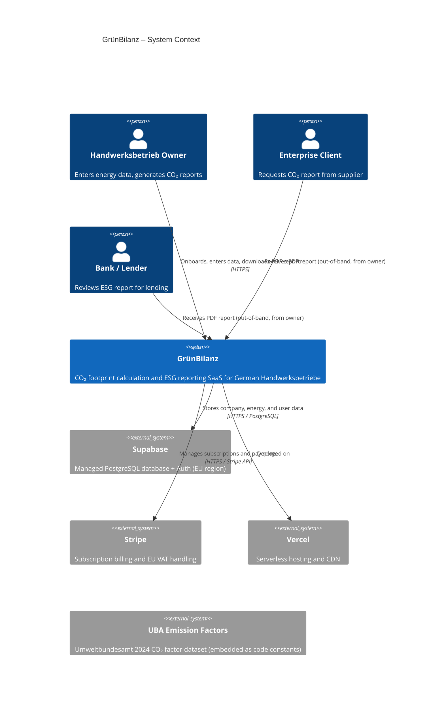
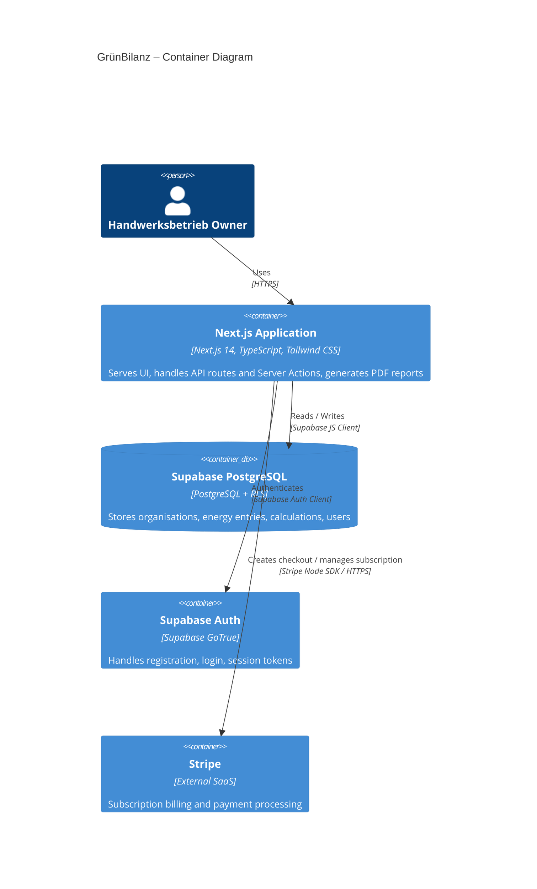
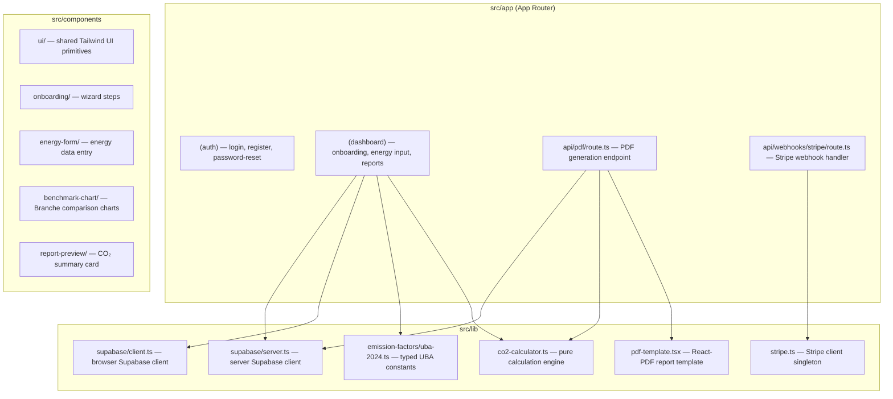
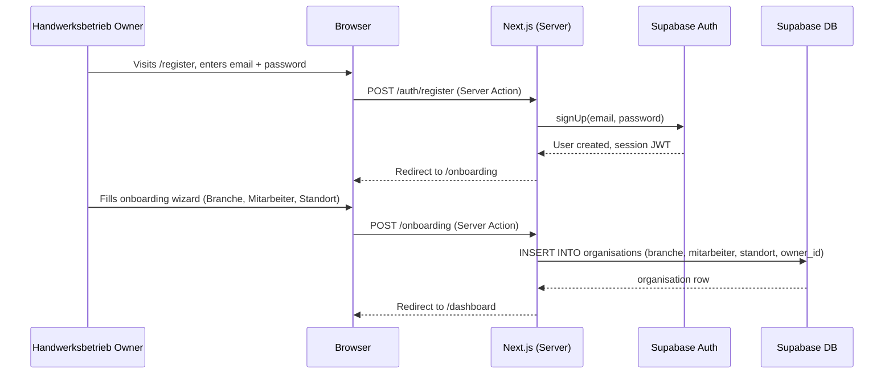
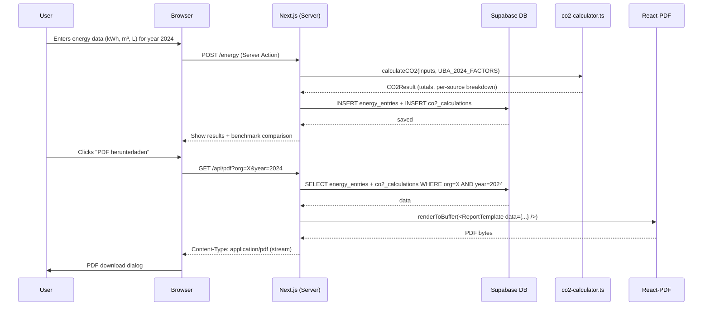
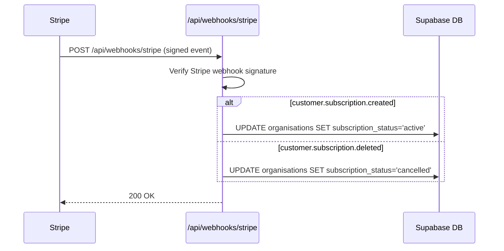
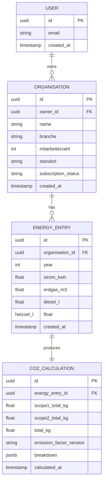

# Architecture Documentation (arc42)

**Project:** GrünBilanz  
**Version:** 1.0  
**Date:** 2026-03-19  
**Status:** Draft

---

## About arc42

This document follows the [arc42 template](https://arc42.org/) for architecture documentation. arc42 is a proven, practical template for software architecture communication and documentation.

---

## 1. Introduction and Goals

### 1.1 Requirements Overview

GrünBilanz is a B2B SaaS platform for CO₂ footprint calculation and ESG reporting, targeting German *Handwerksbetriebe* (craft/trade businesses) with 10–100 employees. The core business driver is enabling small businesses to respond to CO₂ data requests from large enterprise clients (CSRD supply-chain disclosure) and financial institutions (bank sustainability assessments).

**Core functional requirements:**

- **Company onboarding** — capture Branche (industry sector), Mitarbeiterzahl (employee count), and Standort (location)
- **Energy data input** — structured entry of Strom (electricity kWh), Erdgas (natural gas m³), Diesel (litres), and Heizöl (heating oil litres) per period
- **CO₂ calculation** — GHG Protocol Scope 1 & 2 using UBA 2024 emission factors; transparent per-source breakdown
- **Industry benchmark comparison** — compare a company's footprint against sector averages (*Branche*-level benchmarks)
- **PDF report export** — GHG Protocol-compliant PDF suitable for submission to clients/banks
- **Multi-year data storage** — retain historical emission data for trend analysis and year-on-year comparison

**Out of scope for MVP:**

- Scope 3 emissions
- DATEV accounting integration
- OCR-based document import
- Custom emission factor upload

### 1.2 Quality Goals

| Priority | Quality Goal | Scenario |
|----------|-------------|----------|
| 1 | **Data Privacy & DSGVO Compliance** | All personal and business data is stored within EU regions; end-users can exercise DSGVO rights (access, deletion) via self-service |
| 2 | **Report Generation Performance** | A PDF report is generated and available for download in under 3 seconds for any historical dataset |
| 3 | **Correctness of CO₂ Calculations** | Emission factor values match the officially published UBA 2024 dataset; calculation logic is unit-tested with verified reference values |
| 4 | **Usability for Non-Technical Users** | A Handwerksbetrieb owner with no sustainability background can complete onboarding and produce their first report within 15 minutes |
| 5 | **Maintainability** | A developer unfamiliar with the codebase can add a new emission factor category within half a day without touching unrelated modules |

### 1.3 Stakeholders

| Role | Expectations | Concerns |
|------|-------------|----------|
| **Handwerksbetrieb Owner / Operator** | Simple German-language UI, fast report generation, affordable pricing | Data privacy, correctness of output, ease of use |
| **Large Enterprise Client (CSRD requester)** | Standardised, auditable PDF reports from suppliers | Report format compliance, data reliability |
| **Bank / Financial Institution** | ESG baseline data for lending decisions | Regulatory-grade output, consistency across borrowers |
| **GrünBilanz Development Team** | Clear architecture, testable codebase, low operational overhead | Scope creep, emission factor maintenance, Supabase limitations |
| **Regulators / Auditors** | GHG Protocol and UBA methodology compliance | Auditability of calculation logic |

---

## 2. Constraints

### 2.1 Technical Constraints

| Constraint | Background / Motivation |
|------------|------------------------|
| **Next.js 14 (App Router) + TypeScript** | Chosen stack — enables SSR, React Server Components, and API Routes in a single deployment unit |
| **Supabase (PostgreSQL + Auth)** | Managed BaaS providing database, row-level security, and authentication without separate infrastructure |
| **Supabase EU region** | DSGVO requires EU data residency; Supabase Frankfurt/EU region is the mandatory deployment target |
| **Vercel deployment** | Optimised for Next.js; zero-ops serverless deployment with edge network |
| **React-PDF for PDF generation** | Renders PDF server-side within a Next.js API Route; no external PDF service dependency |
| **Stripe for payments** | Standard B2B SaaS payment infrastructure; handles EU VAT via Stripe Tax |
| **No OCR / no DATEV** | Explicitly excluded from MVP to reduce scope and third-party dependencies |
| **UBA 2024 emission factors** | Legally anchored reference dataset; must be stored as versioned, auditable constants |

### 2.2 Organizational Constraints

| Constraint | Background / Motivation |
|------------|------------------------|
| **German-language UI and support** | Target market is German Handwerksbetriebe; English-only UI creates adoption barriers |
| **Small team / startup context** | Architecture must minimise operational burden — favour managed services over self-hosted infrastructure |
| **MVP scope discipline** | Scope 3, DATEV, OCR are explicitly deferred; avoid design decisions that make future additions impossible |
| **CSRD supply-chain pressure** | Time-to-market matters; enterprises are requesting CO₂ data from suppliers now |

### 2.3 Conventions

| Convention | Description |
|------------|-------------|
| **TypeScript strict mode** | `strict: true` in `tsconfig.json`; `const` over `let`, named exports preferred |
| **ESLint + Prettier** | Enforced via pre-commit hooks; code style is not negotiable |
| **Git workflow** | Feature branches (`feature/NNN-slug`), conventional commits, rebase-merge strategy |
| **Documentation** | Markdown in `docs/`; ADRs for significant decisions; arc42 for system overview |
| **Emission factors as code** | UBA emission factors are stored as typed constants with version metadata — never in a user-editable table |

---

## 3. Context and Scope

### 3.1 Business Context



**Communication Partners:**

| Partner | Input to GrünBilanz | Output from GrünBilanz |
|---------|--------------------|-----------------------|
| Handwerksbetrieb Owner | Company profile, annual energy data | CO₂ calculation results, PDF report, benchmark charts |
| Supabase | Authentication tokens, query results | Structured data (company, energy entries, users) |
| Stripe | Webhook events (subscription created/cancelled) | Checkout session creation, customer portal redirects |
| UBA 2024 Dataset | Emission factors (compiled into code) | Used in CO₂ calculations |

### 3.2 Technical Context

| Interface | Description | Protocol / Format |
|-----------|-------------|------------------|
| **Browser ↔ Next.js** | All user-facing pages and interactions | HTTPS, HTML/JSON (SSR + Client) |
| **Next.js ↔ Supabase** | Database reads/writes and Auth | HTTPS, Supabase JS client (REST + Realtime) |
| **Next.js ↔ Stripe** | Subscription management | HTTPS, Stripe Node SDK |
| **Next.js PDF endpoint** | PDF generation per company/year | HTTPS, `application/pdf` response |
| **Vercel Edge Network** | Static asset caching, SSL termination | HTTPS |

---

## 4. Solution Strategy

| Quality Goal | Approach | Rationale |
|--------------|----------|-----------|
| **DSGVO / Data Privacy** | Supabase EU region + Row-Level Security (RLS) policies | Data never leaves EU; RLS ensures tenants cannot access each other's data at the database layer |
| **Report Performance < 3s** | Server-side PDF rendering with React-PDF inside a Next.js API Route; pre-computed CO₂ totals stored in DB | Avoids client-side PDF generation latency; DB aggregates avoid real-time recalculation on every export |
| **Calculation Correctness** | UBA 2024 emission factors stored as typed, versioned constants; calculation logic in a pure, unit-tested module | Separation from UI and DB makes the calculation engine independently testable and auditable |
| **Usability** | German-language UI; wizard-style onboarding; sensible defaults per Branche | Reduces cognitive load for non-technical SMB owners |
| **Maintainability** | Domain-oriented module structure; thin API routes delegating to service layer; Prisma-style typed DB access | Clear boundaries allow adding new emission categories or report types without touching unrelated code |

**Key Technology Decisions:**

- **Next.js 14 App Router** — SSR by default with React Server Components; file-system routing reduces boilerplate; Server Actions replace dedicated API endpoints for form submissions
- **Supabase** — eliminates need to operate a separate auth server, connection pooler, and managed PostgreSQL; RLS handles multi-tenancy natively
- **Tailwind CSS** — utility-first styling, no runtime CSS-in-JS overhead, consistent design system
- **React-PDF** — renders PDF server-side using JSX/React component trees; type-safe, no headless browser required
- **Stripe** — battle-tested EU-compliant billing; handles SEPA, VAT, invoicing

**Architectural Patterns:**

- **Multi-tenant SaaS with RLS** — each *Organisation* (company) is a tenant; Supabase RLS policies enforce isolation at the database layer
- **Server-first rendering** — React Server Components fetch data directly; client components used only where interactivity is required
- **Pure calculation engine** — CO₂ computation is a side-effect-free function of energy inputs × emission factors; fully testable in isolation
- **Versioned emission factors** — UBA factors are typed constants in `src/lib/emission-factors/uba-2024.ts`; a future update ships as `uba-2025.ts` with a DB column tracking which version was used per calculation

---

## 5. Building Block View

### 5.1 Level 1: System Overview



**Components:**

| Component | Responsibility | Key Interfaces |
|-----------|----------------|---------------|
| **Next.js Application** | Serves all UI pages (App Router), handles Server Actions (form processing), exposes API routes for PDF generation and Stripe webhooks | HTTPS (browser), Supabase JS, Stripe SDK |
| **Supabase PostgreSQL** | Persists all business data with RLS-enforced multi-tenancy | Supabase JS / PostgREST |
| **Supabase Auth** | User registration, login, password reset, session management (JWT) | Supabase Auth client |
| **Stripe** | Subscription creation, payment processing, EU VAT, invoicing | Stripe Webhooks → `/api/webhooks/stripe` |

### 5.2 Level 2: Next.js Application Internal Structure



**Sub-components:**

- **`co2-calculator.ts`** — pure function `calculateCO2(inputs: EnergyInputs, factors: EmissionFactors): CO2Result`; no side effects; fully unit-tested
- **`uba-2024.ts`** — typed emission factors: electricity (grid mix), natural gas, diesel, heating oil; annotated with source, year, unit
- **`pdf-template.tsx`** — React-PDF component tree rendering GHG Protocol-compliant PDF layout
- **`(dashboard)` route group** — all authenticated pages; wraps in session guard via Supabase middleware
- **`api/pdf/route.ts`** — streams PDF bytes; validates ownership of requested organisation via Supabase RLS

---

## 6. Runtime View

### 6.1 Scenario: Company Onboarding

**Description:** A new user registers and completes the company onboarding wizard.



### 6.2 Scenario: CO₂ Report Generation and PDF Export

**Description:** An authenticated user submits energy data for a year and downloads a PDF report.



### 6.3 Scenario: Stripe Subscription Webhook

**Description:** Stripe sends a webhook after a customer subscribes or cancels.



---

## 7. Deployment View

### 7.1 Infrastructure

```mermaid
graph TB
    subgraph "User's Browser"
        Browser[Browser]
    end

    subgraph "Vercel (Global Edge Network)"
        CDN[Edge CDN — static assets]
        subgraph "Vercel Serverless Functions (Frankfurt region)"
            RSC[React Server Components / Pages]
            SA[Server Actions]
            API_PDF[/api/pdf]
            API_STRIPE[/api/webhooks/stripe]
        end
    end

    subgraph "Supabase (EU / Frankfurt)"
        AUTH[Supabase Auth — GoTrue]
        PGDB[(PostgreSQL — Row-Level Security)]
    end

    subgraph "Stripe (EU)"
        STRIPE_API[Stripe API]
        STRIPE_WEBHOOK[Stripe Webhooks]
    end

    Browser --> CDN
    Browser --> RSC
    RSC --> AUTH
    RSC --> PGDB
    SA --> PGDB
    API_PDF --> PGDB
    API_STRIPE --> STRIPE_API
    STRIPE_WEBHOOK --> API_STRIPE
```

**Nodes:**

| Node | Description | Technology |
|------|-------------|------------|
| **Vercel Edge CDN** | Serves static assets (JS bundles, images, fonts) from global PoP | Vercel infrastructure |
| **Vercel Serverless Functions** | Runs Next.js RSC, Server Actions, and API Routes on-demand; Frankfurt region for EU data residency | Node.js on Vercel |
| **Supabase Auth** | Manages user identities, JWT issuance, password reset emails | Supabase GoTrue (EU region) |
| **Supabase PostgreSQL** | Persistent storage with RLS; connection pooling via Supabase | Managed PostgreSQL (EU region) |
| **Stripe** | Payment processing; webhooks delivered to `/api/webhooks/stripe` | Stripe SaaS |

### 7.2 Environments

| Environment | Purpose | Configuration |
|-------------|---------|---------------|
| **Development** | Local development | `npm run dev`; `.env.local` with Supabase local or dev project; Stripe test mode |
| **Staging** | Pre-production validation | Vercel preview deployment per PR branch; Supabase staging project; Stripe test mode |
| **Production** | Live system | Vercel production deployment (`main` branch); Supabase EU production project; Stripe live mode |

---

## 8. Crosscutting Concepts

### 8.1 Domain Model



**Key domain terms:**

- **Organisation** — the tenant entity representing a Handwerksbetrieb; all data is scoped to an organisation
- **EnergyEntry** — annual energy consumption data for one organisation and one calendar year
- **CO2Calculation** — immutable record of emission totals computed from an EnergyEntry; stores the emission factor version used

### 8.2 Security

- **Authentication:** Supabase Auth (email/password); JWT issued per session; refresh tokens rotated automatically
- **Authorization / Multi-tenancy:** Supabase Row-Level Security (RLS) — every table has a policy restricting access to `auth.uid() = owner_id`; a user cannot read or write another organisation's data even if they know the UUID
- **Stripe Webhooks:** Verified via `stripe.webhooks.constructEvent()` with the signing secret before processing
- **Transport Security:** All traffic over HTTPS; Vercel enforces TLS 1.2+ by default
- **Secret Management:** API keys (`SUPABASE_SERVICE_ROLE_KEY`, `STRIPE_SECRET_KEY`, `STRIPE_WEBHOOK_SECRET`) stored as Vercel environment variables; never committed to source control
- **Input Validation:** Server Actions and API Routes validate all inputs with [Zod](https://zod.dev/) schemas before touching the database
- **Emission Factor Integrity:** Factors are compiled-in constants, not user-editable DB rows, preventing tampering

### 8.3 Error Handling

- **Logging:** Structured `console.error` with context in development; in production, Vercel captures unhandled errors; future: integrate a log aggregator (e.g., Axiom)
- **User-facing errors:** Server Actions return typed error objects (`{ error: string }`); the UI renders friendly German error messages
- **PDF generation failure:** API Route returns HTTP 500 with a JSON error; client shows a retry button
- **Stripe webhook failures:** Route returns non-200 only on signature verification failure; Stripe retries all other errors automatically
- **Calculation errors:** The `co2-calculator` module throws typed errors for invalid inputs (negative values, unknown fuel types); caught at the Server Action layer

### 8.4 Testing

- **Unit Tests (Vitest):** `co2-calculator.ts` and emission factor utilities are the primary unit-test targets; reference values from UBA 2024 documentation used as expected outputs
- **Integration Tests:** Supabase local instance with seeded test data; test Server Actions end-to-end including RLS validation
- **End-to-End Tests (Playwright):** Critical user journeys: register → onboard → enter data → download PDF
- **PDF snapshot tests:** React-PDF render snapshots guard against unintended layout regressions
- **Coverage goal:** >80% for `src/lib/` (calculation and data-access layer)

### 8.5 Configuration Management

- **Approach:** Environment variables via `.env.local` (development) and Vercel project settings (staging/production)
- **Required variables:**
  - `NEXT_PUBLIC_SUPABASE_URL` / `NEXT_PUBLIC_SUPABASE_ANON_KEY` — public, safe in browser
  - `SUPABASE_SERVICE_ROLE_KEY` — server-only; never sent to browser
  - `STRIPE_SECRET_KEY` / `STRIPE_WEBHOOK_SECRET` — server-only
  - `NEXT_PUBLIC_STRIPE_PUBLISHABLE_KEY` — public, safe in browser
- **Secrets:** Never committed to source control; `.env.local` is in `.gitignore`
- **Emission factor version:** Controlled via a TypeScript import, not an env var; changing requires a code deploy

---

## 9. Architecture Decisions

### Existing ADRs

This project is in initial setup phase. The ADR template is available at [`docs/000-initial-project-setup-architecture.md`](000-initial-project-setup-architecture.md). The following decisions have been made and should be formalised as ADRs:

| # | Decision | Status | Notes |
|---|----------|--------|-------|
| ADR-001 | Use Next.js 14 App Router as the full-stack framework | Accepted | Single deployment unit; SSR + Server Actions reduce API boilerplate |
| ADR-002 | Use Supabase for database and authentication | Accepted | EU data residency; RLS for multi-tenancy; eliminates separate auth service |
| ADR-003 | Use React-PDF for server-side PDF generation | Accepted | No headless browser; type-safe JSX templates; meets < 3s target |
| ADR-004 | Embed UBA 2024 emission factors as versioned code constants | Accepted | Auditable, testable, tamper-proof; version tracked per CO2Calculation row |

### Key Decisions with Open Options

#### ADR-005 (Proposed): Benchmark Data Strategy

The industry benchmark comparison requires sector-average CO₂ intensities per *Branche*.

**Option A — Hardcoded constants (same pattern as emission factors)**
- Pros: Zero DB overhead, always available, auditable
- Cons: Requires code deploy to update benchmarks; inflexible for dynamic benchmarks based on actual user data

**Option B — Supabase table seeded at deploy time**
- Pros: Updatable without code deploy; future potential for community-derived benchmarks
- Cons: Adds DB dependency to benchmark display; requires migration on benchmark updates

**Option C — Aggregate from live user data (rolling average)**
- Pros: Self-improving benchmarks
- Cons: Data availability risk at MVP stage (sparse data); privacy implications for small Branchen

**Recommendation:** Option A for MVP (consistent with emission factor approach); migrate to Option B post-MVP when benchmarks need regular updates.

---

## 10. Quality Requirements

### 10.1 Quality Tree

```
Quality
├── Data Privacy & Compliance
│   ├── DSGVO compliance (EU data residency, right to erasure)
│   └── GHG Protocol compliance (Scope 1 & 2 methodology)
├── Performance
│   ├── PDF generation < 3 seconds
│   └── Dashboard page load < 2 seconds (LCP)
├── Correctness
│   ├── Emission factor accuracy (matches UBA 2024 publication)
│   └── Calculation reproducibility (same inputs → same outputs)
├── Security
│   ├── Tenant isolation (RLS — no cross-organisation data access)
│   └── Secret management (no keys in source control)
├── Usability
│   ├── German UI throughout
│   └── Onboarding completable in < 15 minutes
└── Maintainability
    ├── Pure calculation engine (independently testable)
    └── Typed emission factors (compiler catches factor errors)
```

### 10.2 Quality Scenarios

| ID | Quality | Scenario | Expected Response | Measure |
|----|---------|----------|------------------|---------|
| QS-1 | Performance | User clicks "PDF herunterladen" for a company with 5 years of data | PDF is returned as a download | < 3 seconds end-to-end |
| QS-2 | Correctness | 10,000 kWh electricity entered; German grid mix 2024 | CO₂ result = 10,000 × 0.380 kg/kWh = 3,800 kg CO₂e | Unit test assertion; deviation = 0 |
| QS-3 | Security | Authenticated user A requests PDF for organisation owned by user B | Request rejected with 403 | 100% of test cases blocked by RLS |
| QS-4 | Privacy | User requests account deletion | All organisation, energy, and calculation rows deleted; Supabase Auth user deleted | Verified by integration test |
| QS-5 | Usability | Non-technical SMB owner, first visit | Completes onboarding + first CO₂ entry + downloads PDF | < 15 minutes (usability test target) |
| QS-6 | Maintainability | Developer adds "Flüssiggas" as a new fuel type | New entry in `uba-2024.ts`, new DB column, updated form, updated calculator | < 4 hours estimated; no changes to unrelated modules |

---

## 11. Risks and Technical Debt

### 11.1 Risks

| Risk | Probability | Impact | Mitigation |
|------|-------------|--------|------------|
| **Supabase EU region outage** | Low | High | Vercel + Supabase have independent SLAs; display maintenance page gracefully; consider Supabase backups to separate EU object storage |
| **UBA emission factors change significantly** | Medium | High | Factors stored as versioned constants; each CO2Calculation records which version was used; historical reports remain correct after factor update |
| **PDF generation exceeds 3s for large datasets** | Low | Medium | Pre-compute and store CO₂ totals; benchmark with 10+ years of multi-entry data; add streaming/progress indicator if threshold is exceeded |
| **Stripe API unavailability** | Low | Medium | Payment failures are surfaced as user-friendly errors; subscription status is cached in DB and checked locally; no data loss risk |
| **DSGVO right-to-erasure not fully implemented at MVP** | Medium | High | Define deletion cascade in DB schema from day one; implement user-facing deletion endpoint in MVP; test with integration tests |
| **Low initial benchmark data (sparse Branchen)** | High (MVP) | Medium | Use hardcoded industry-average benchmarks from published sources (UBA, DIHK) for MVP; replace with aggregated data post-launch |

### 11.2 Technical Debt

| Item | Description | Impact | Priority | Plan |
|------|-------------|--------|----------|------|
| **No Scope 3 emissions** | MVP covers only Scope 1 & 2; Scope 3 (supply chain, business travel) is deferred | Medium | Post-MVP | Architecture supports extension: new fuel/activity types in `uba-2024.ts`; Scope 3 entries would follow same `EnergyEntry` + `CO2Calculation` pattern |
| **No DATEV integration** | Manual energy data entry; no import from accounting software | Medium | Post-MVP | Depends on DATEV API availability and user demand; defer until post-launch validation |
| **Benchmarks are static constants** | Industry benchmarks hardcoded; not derived from actual platform data | Low | Post-MVP | Migrate to Supabase seeded table (ADR-005 Option B) once data volume is sufficient |
| **No automated monitoring/alerting** | No APM or error-rate alerting configured at launch | Medium | Early Post-MVP | Add Vercel Analytics for LCP; integrate Sentry or Axiom for error tracking; define alerting thresholds |
| **Email verification not enforced at MVP** | Supabase Auth sends verification emails but access is not blocked pending verification | Low | Post-MVP | Enable `email_confirm` setting in Supabase Auth after launch to prevent unverified accounts |

---

## 12. Glossary

| Term | Definition |
|------|------------|
| **Branche** | Industry sector classification for the Handwerksbetrieb (e.g., Elektro, Sanitär, Bäckerei) |
| **CO₂e** | CO₂ equivalent — unit that normalises all greenhouse gases to their global warming potential relative to CO₂ |
| **CSRD** | Corporate Sustainability Reporting Directive — EU regulation requiring large companies to disclose ESG data, including supply-chain emissions (driving demand for GrünBilanz) |
| **DSGVO** | Datenschutz-Grundverordnung — German term for GDPR; the EU personal data protection regulation |
| **ESG** | Environmental, Social, and Governance — sustainability performance criteria used by investors and large clients |
| **GHG Protocol** | Greenhouse Gas Protocol — the most widely used international accounting standard for greenhouse gas emissions |
| **Handwerksbetrieb** | A German craft/trade business (e.g., electrician, plumber, baker); the primary target customer of GrünBilanz |
| **Heizöl** | Heating oil — one of the tracked energy carriers for Scope 1 emissions |
| **Mitarbeiterzahl** | Number of employees — used for per-capita benchmarking and Branche comparison |
| **RLS** | Row-Level Security — Supabase / PostgreSQL feature that enforces data access policies at the database layer; the primary multi-tenancy mechanism |
| **Scope 1** | Direct greenhouse gas emissions from sources owned or controlled by the organisation (e.g., on-site gas boilers, diesel vehicles) |
| **Scope 2** | Indirect emissions from purchased electricity, heat, or steam |
| **Scope 3** | All other indirect emissions in the value chain; excluded from GrünBilanz MVP |
| **Standort** | Location / registered address of the Handwerksbetrieb |
| **UBA** | Umweltbundesamt — Germany's Federal Environment Agency; publishes annual CO₂ emission factors used in GrünBilanz calculations |
| **ADR** | Architecture Decision Record — documents significant architectural choices with context, options, and rationale |
| **RLS** | Row-Level Security — PostgreSQL / Supabase access control mechanism enforcing tenant isolation at the DB layer |
| **Server Action** | Next.js 14 feature allowing form submissions and mutations to be handled by server-side functions without a separate API endpoint |

---

## Appendix

### A. References

- [arc42 Template](https://arc42.org/)
- [GHG Protocol Corporate Standard](https://ghgprotocol.org/corporate-standard)
- [UBA CO₂ Emissionsfaktoren 2024](https://www.umweltbundesamt.de/themen/klima-energie/energieversorgung/strom-waermeversorgung-in-zahlen/emissionsfaktoren)
- [CSRD Directive (EU) 2022/2464](https://eur-lex.europa.eu/legal-content/EN/TXT/?uri=CELEX:32022L2464)
- [Supabase Row-Level Security Docs](https://supabase.com/docs/guides/auth/row-level-security)
- [React-PDF Documentation](https://react-pdf.org/)
- [Next.js 14 App Router Documentation](https://nextjs.org/docs/app)
- [ADR Template — Initial Project Setup](000-initial-project-setup-architecture.md)

### B. Revision History

| Version | Date | Author | Changes |
|---------|------|--------|---------|
| 1.0 | 2026-03-19 | Architect Agent | Initial arc42 architecture documentation for GrünBilanz MVP |

---

**Note:** This document is a living artifact. Update sections when the architecture evolves — particularly after significant design decisions, new quality requirements, or changes to the deployment infrastructure.
